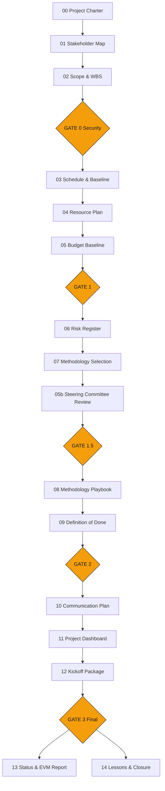

# Pipeline de Orchestration

> PMO-APEX — Ontologia viva
> Referencia canonica del pipeline de gestion de proyectos: 10 fases, 5 quality gates, 16 entregables.

---

## Vision general

El pipeline de PMO-APEX transforma un engagement de gestion de proyectos en un conjunto de entregables de planificacion, ejecucion y control con evidencia trazable. Opera en 10 fases secuenciales (0-7), controladas por 5 quality gates (G0-G3) que actuan como hard stops, y monitoreado por 13 checkpoints.

---

## Diagrama del pipeline

---

## Fases del pipeline

### Fase 0 — Initiation (Charter & Stakeholders)
| Entregable | Skill | Comando |
|-----------|-------|---------|
| 00 Project Charter | `charter-development` | `/pm:generate-charter` |
| 01 Stakeholder Map | `stakeholder-mapping` | `/pm:map-stakeholders` |

### Fase 1 — Context & Scoping
| Entregable | Skill | Comando |
|-----------|-------|---------|
| 02 Scope & WBS | `scope-management` | `/pm:define-scope` |

### Fase 2 — Planning & Baseline (GATE 0)
| Entregable | Skill | Comando |
|-----------|-------|---------|
| 03 Schedule & Baseline | `schedule-planning` | `/pm:plan-schedule` |
| 04 Resource Plan | `resource-planning` | `/pm:plan-resources` |
| 05 Budget Baseline | `budget-management` | `/pm:plan-budget` |

### Fase 3 — Risk & Methodology (GATE 1)
| Entregable | Skill | Comando |
|-----------|-------|---------|
| 06 Risk Register | `risk-management` | `/pm:assess-risks` |
| 07 Methodology Selection | `methodology-selection` | `/pm:select-methodology` |
| 05b Steering Committee Review | `steering-committee` | `/pm:convene-steering` |

### Fase 3b — Steering Committee Review (GATE 1.5)
El Steering Committee (7 Advisors) evalua la viabilidad del plan en 7 dimensiones: schedule, budget, risk, resources, methodology, governance, stakeholder alignment.

### Fase 4 — Execution Framework (GATE 2)
| Entregable | Skill | Comando |
|-----------|-------|---------|
| 08 Methodology Playbook | `methodology-playbook` | `/pm:design-methodology` |
| 09 Definition of Done | `quality-criteria` | `/pm:define-dod` |

### Fase 5 — Communication & Dashboard
| Entregable | Skill | Comando |
|-----------|-------|---------|
| 10 Communication Plan | `communication-planning` | `/pm:plan-communications` |
| 11 Project Dashboard | `dashboard-design` | `/pm:present-dashboard` |

### Fase 6 — Kickoff Package
| Entregable | Skill | Comando |
|-----------|-------|---------|
| 12 Kickoff Package | `kickoff-orchestration` | `/pm:deliver-kickoff` |

### Fase 7 — Reports (GATE 3)
| Entregable | Skill | Comando |
|-----------|-------|---------|
| 13 Status & EVM Report | `evm-reporting` | `/pm:report-status` |
| 14 Lessons & Closure | `project-closure` | `/pm:close-project` |

---

## Modelo de checkpoints

| Checkpoint | Momento | Verificacion |
|-----------|---------|-------------|
| CP-0 | Pre-Charter | Plugin activo, RAG priming cargado, sesion inicializada |
| CP-1 | Post-Charter | Charter aprobado, sponsor identificado, objetivos claros |
| CP-2 | Post-Stakeholders | Mapa de stakeholders completo, matriz poder/interes documentada |
| CP-3 | Post-Scope | WBS completa, criterios de aceptacion definidos, scope statement firmado |
| CP-G0 | Gate 0 | Escaneo de seguridad completado, datos sensibles enmascarados |
| CP-4 | Post-Baseline | Cronograma con ruta critica, recursos asignados, presupuesto aprobado |
| CP-G1 | Gate 1 | Risk register completo, metodologia propuesta, baseline triple aprobada |
| CP-5 | Post-Steering | 7 Advisors han emitido veredicto, >=5/7 Go |
| CP-G15 | Gate 1.5 | Steering aprobado, condiciones documentadas |
| CP-6 | Post-Methodology | Playbook completo, DoD definido, ceremonies calendarizadas |
| CP-G2 | Gate 2 | Framework de ejecucion listo, equipo alineado |
| CP-7 | Post-Kickoff | Kickoff ejecutado, dashboard configurado, comunicacion activa |
| CP-G3 | Gate 3 | Consistencia cruzada, excellence-loop pasado, closure completo |
| CP-F | Final | Todos los reportes generados, lecciones documentadas, proyecto cerrado |

---

## Lista de 16 entregables

| # | Entregable | Formato | Obligatorio |
|---|-----------|---------|-------------|
| 00 | Project Charter | MD | Si |
| 01 | Stakeholder Map | MD + Mermaid | Si |
| 02 | Scope & WBS | MD + Mermaid | Si |
| 03 | Schedule & Baseline | MD + Gantt | Si |
| 04 | Resource Plan | MD + Mermaid | Si |
| 05 | Budget Baseline | MD + XLSX | Si |
| 05b | Steering Committee Review | MD | Si |
| 06 | Risk Register | MD | Si |
| 07 | Methodology Selection | MD | Si |
| 08 | Methodology Playbook | MD | Si |
| 09 | Definition of Done | MD | Si |
| 10 | Communication Plan | MD | Condicional |
| 11 | Project Dashboard | MD + HTML | Si |
| 12 | Kickoff Package | MD + HTML | Si |
| 13 | Status & EVM Report | MD + HTML | Opcional |
| 14 | Lessons & Closure | MD | Opcional |

---

## Modos de ejecucion

| Modo | Comando | Entregables | Gates |
|------|---------|------------|-------|
| `run-guided` | `/pm:run-guided` | 16 (todos) | 5 con pausa humana |
| `run-auto` | `/pm:run-auto` | 16 (todos) | 5 con auto-aprobacion |
| `run-express` | `/pm:run-express` | 3 (Charter + Risk Register + Kickoff) | G1 simplificado |
| `run-deep` | `/pm:run-deep` | 7 (planificacion profunda + EVM) | G1 + G2 |

---

*PMO-APEX — La excelencia en gestion de proyectos se construye con evidencia.*
