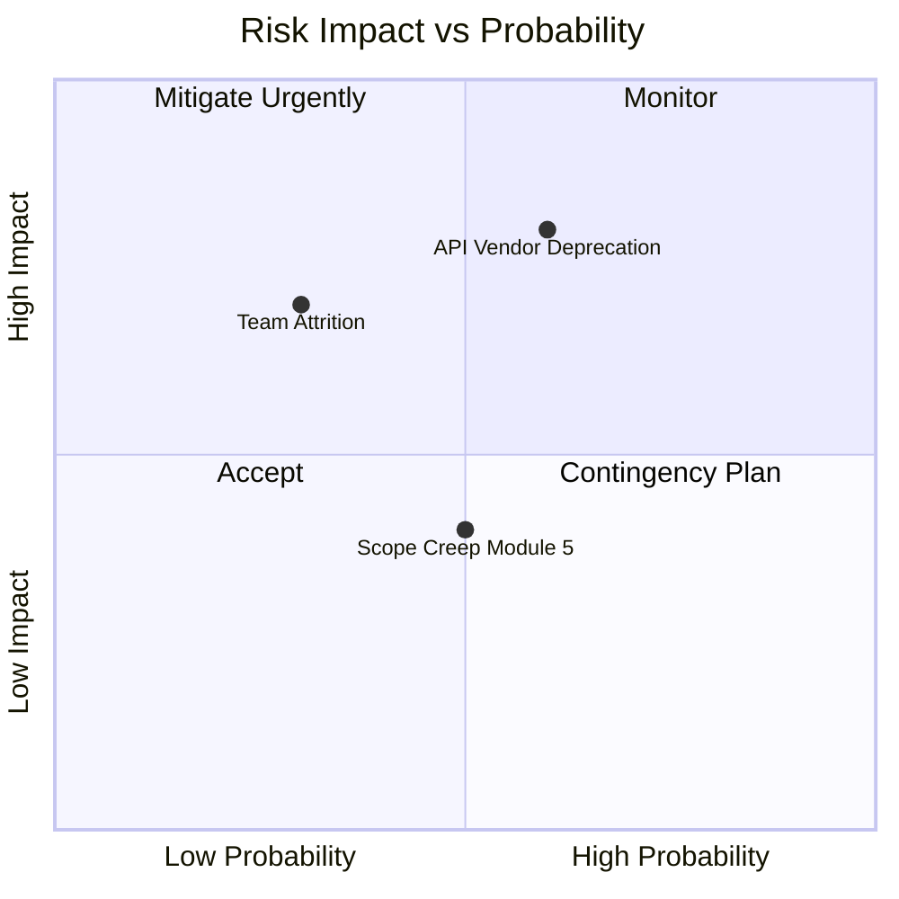

# AI-Generated Sprint Status Report — Acme Corp, Project Phoenix

**Date**: 2026-03-14 | **Sprint**: 12 | **Generated by**: PMO-APEX AI PM Assistant | **Confidence**: 87%

## TL;DR

Sprint 12 completed with 89% planned velocity achieved. Two P1 blockers resolved. One new risk identified: API vendor deprecation affecting Q3 integration milestone. Recommend: vendor contingency planning session next sprint.

## Sprint Scorecard

| Metric | Target | Actual | Status | Evidence |
|--------|--------|--------|--------|----------|
| Story Points Completed | 34 | 30 | Amber | 2 stories carried over [METRIC] |
| Sprint Goal Achievement | 100% | 85% | Amber | Payment module partial [SCHEDULE] |
| Defect Escape Rate | <5% | 3% | Green | 1 production defect [METRIC] |
| Team Satisfaction | >7/10 | 7.8/10 | Green | Pulse survey results [STAKEHOLDER] |

## Key Accomplishments

1. **User authentication module** — Feature complete, deployed to staging [METRIC]
2. **Performance optimization** — API response time reduced from 450ms to 180ms [METRIC]
3. **Stakeholder demo** — Product Owner approved 3 of 4 features [STAKEHOLDER]

## Active Blockers

| ID | Blocker | Owner | Days Open | Resolution Path |
|----|---------|-------|-----------|----------------|
| B-12-01 | Resolved: Third-party SSL certificate renewal | DevOps Lead | 0 | Certificate renewed and deployed [METRIC] |
| B-12-02 | Resolved: Staging environment disk space | Platform Team | 0 | Auto-scaling policy applied [METRIC] |

## Risks & Issues

| Risk | Probability | Impact | Mitigation | Owner |
|------|------------|--------|-----------|-------|
| API vendor deprecation (NEW) | High | High | Identify alternative vendors; prototype by Sprint 14 [PLAN] | Tech Lead |
| Team attrition (key developer) | Low | High | Knowledge sharing sessions this sprint [INFERENCIA] | Scrum Master |
| Scope creep Module 5 | Medium | Medium | Enforce change control process [PLAN] | Product Owner |

## Upcoming Sprint 13 Focus

- Complete payment module integration (carryover) [SCHEDULE]
- Begin API vendor contingency analysis [PLAN]
- User acceptance testing for authentication module [METRIC]
- Estimated velocity: 32 story points [INFERENCIA]

## Confidence Assessment

| Section | Confidence | Source |
|---------|-----------|--------|
| Sprint metrics | High | Jira data extraction [METRIC] |
| Risk assessment | Medium | Pattern matching + team input [INFERENCIA] |
| Next sprint velocity | Medium | 3-sprint rolling average [METRIC] |
| Vendor risk impact | Low | Limited information available [SUPUESTO] |

> **AI Disclosure**: This report was generated by PMO-APEX AI PM Assistant. All [METRIC] items are data-backed. Items tagged [INFERENCIA] or [SUPUESTO] require human validation before decision-making.

*PMO-APEX v1.0 — Sample Output · AI PM Assistant*
