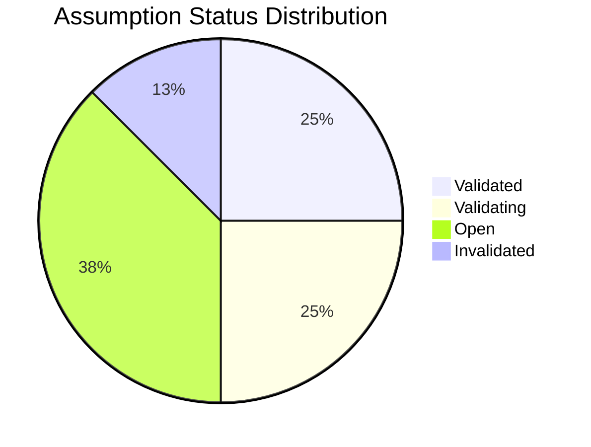

# Assumption Log — Acme Corp Cloud Migration Project

**Project**: Cloud Migration Phase 2 | **Date**: 2026-Q1 | **Owner**: PMO-APEX Agent

## TL;DR

18 assumptions identified across 6 categories. 4 critical assumptions require validation before Gate G1. 2 assumptions already invalidated, triggering risk responses.

## Assumption Register

| ID | Description | Category | Impact | Prob. | Owner | Validation Method | Target Date | Status | Evidence |
|----|-------------|----------|--------|-------|-------|------------------|-------------|--------|----------|
| A-001 | AWS us-east-1 region meets data residency requirements | Technical | High | High | Cloud Architect | Legal review + AWS compliance docs | 2026-03-20 | Validated | Compliance cert obtained [METRIC] |
| A-002 | Existing database schema compatible with Aurora PostgreSQL | Technical | High | Medium | DBA Lead | Migration dry-run on staging | 2026-03-25 | Validating | Dry-run in progress [SCHEDULE] |
| A-003 | Team has Kubernetes expertise for EKS deployment | Resource | High | Medium | Engineering Manager | Skills assessment survey | 2026-03-18 | Invalidated | 2 of 5 engineers certified [STAKEHOLDER] |
| A-004 | Production cutover window of 4 hours sufficient | Technical | High | Low | DevOps Lead | Load test simulation | 2026-04-01 | Open | Not yet tested [SUPUESTO] |
| A-005 | Monthly cloud budget under 8 FTE-months equivalent | Financial | Medium | Medium | Finance Partner | Cost calculator + PoC metrics | 2026-03-22 | Validating | PoC running [METRIC] |
| A-006 | Vendor SLA guarantees 99.95% uptime | External | High | High | Vendor Manager | Contract review | 2026-03-15 | Validated | SLA clause confirmed [DOC] |
| A-007 | Stakeholders approve 2-week UAT window | Business | Medium | High | Product Owner | Stakeholder meeting | 2026-03-20 | Open | Meeting scheduled [STAKEHOLDER] |
| A-008 | Legacy API consumers can migrate to new endpoints in 30 days | Technical | High | Low | API Lead | Consumer impact analysis | 2026-04-05 | Open | Survey sent [PLAN] |

## Invalidated Assumptions — Risk Responses

### A-003: Team Kubernetes Expertise (INVALIDATED)

- **Original assumption**: Team has sufficient K8s expertise for EKS [SUPUESTO]
- **Reality**: Only 2 of 5 engineers are EKS-certified [METRIC]
- **Impact**: 2-3 sprint delay risk on container orchestration tasks [SCHEDULE]
- **Risk response**:
  - Immediate: Contract 1 K8s specialist (0.5 FTE-month) [PLAN]
  - Short-term: Enroll 2 engineers in CKA certification (3 weeks) [SCHEDULE]
  - Mitigation: Pair programming with specialist during Sprint 3-4 [STAKEHOLDER]

## Validation Dashboard

## Next Actions

| Action | Owner | Due | Priority |
|--------|-------|-----|----------|
| Complete Aurora migration dry-run (A-002) | DBA Lead | 2026-03-25 | P1 |
| Run load test for cutover window (A-004) | DevOps Lead | 2026-04-01 | P1 |
| Stakeholder meeting for UAT window (A-007) | Product Owner | 2026-03-20 | P2 |
| API consumer impact survey follow-up (A-008) | API Lead | 2026-04-05 | P2 |

*PMO-APEX v1.0 — Sample Output · Assumption Log*
