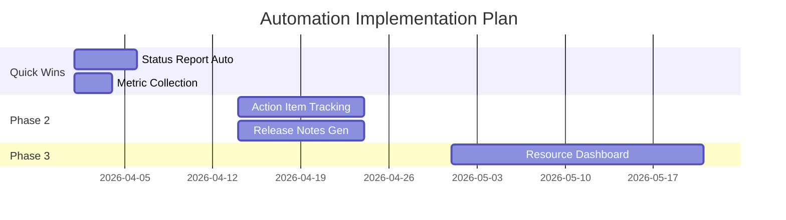

# Automation Opportunities Assessment — Acme Corp PMO

**Date**: 2026-Q1 | **Assessor**: PMO-APEX Agent | **Scope**: 3 project teams, 12 workflows

## TL;DR

12 automation candidates identified. 4 quick wins achievable within 1 sprint. Total potential savings: 8.5 FTE-months/year. Recommended: Start with status report automation (highest ROI, lowest effort).

## Automation Backlog (WSJF Prioritized)

| Rank | Candidate | Category | Feasibility | ROI | Risk | WSJF | Effort |
|------|-----------|----------|------------|-----|------|------|--------|
| 1 | Weekly status report generation | Reporting | 5 | 5 | 1 | 25 | 0.5 sprint |
| 2 | Sprint metric collection from Jira | Data Entry | 5 | 4 | 1 | 20 | 0.25 sprint |
| 3 | Meeting action item tracking | Communication | 4 | 4 | 2 | 12 | 1 sprint |
| 4 | Release notes generation | Documentation | 4 | 3 | 2 | 9 | 1 sprint |
| 5 | Resource availability dashboard | Scheduling | 3 | 4 | 3 | 6 | 2 sprints |

## Quick Wins (Sprint 1)

### QW-1: Status Report Automation

- **Current state**: PM manually compiles data from 3 sources, 2 hours/week [METRIC]
- **Automated state**: Python script pulls Jira data, generates Markdown report, posts to Slack [PLAN]
- **Savings**: 2 hours/week x 52 weeks = 104 hours/year = 0.6 FTE-months/year [METRIC]
- **Implementation**: Jira REST API + Jinja2 templates + Slack webhook [SCHEDULE]

### QW-2: Sprint Metric Collection

- **Current state**: Scrum Master exports Jira data to Excel, calculates metrics manually [METRIC]
- **Automated state**: Scheduled script extracts velocity, burndown, cycle time daily [PLAN]
- **Savings**: 1 hour/week = 52 hours/year = 0.3 FTE-months/year [METRIC]

## ROI Summary

| Metric | Value | Evidence |
|--------|-------|----------|
| Total candidates identified | 12 | Process analysis [METRIC] |
| Quick wins (< 1 sprint) | 4 | Feasibility assessment [PLAN] |
| Annual savings potential | 8.5 FTE-months | Calculation based on current effort [METRIC] |
| Implementation investment | 6 sprints total | Engineering estimate [SCHEDULE] |
| Payback period | 3.2 months | Savings vs. investment [METRIC] |
| Maintenance overhead | 0.5 FTE-months/year | Industry benchmark [INFERENCIA] |

## Implementation Roadmap

*PMO-APEX v1.0 — Sample Output · Automation Opportunities*
