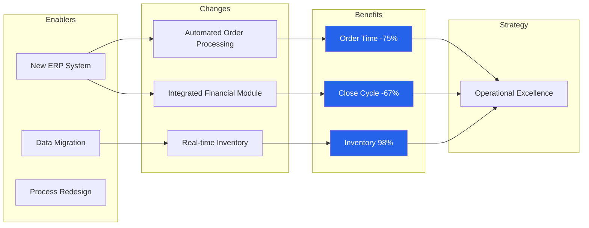
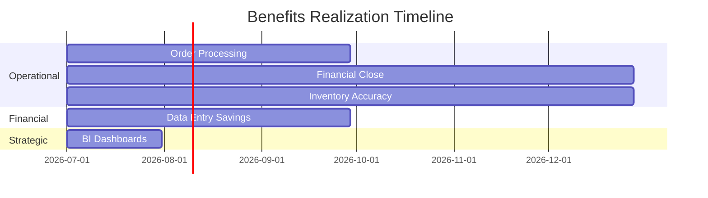

# Benefits Realization Plan — Acme Corp ERP Modernization

**Project**: ERP Modernization Phase 1 | **Date**: 2026-Q1 | **Benefits Owner**: CFO

## TL;DR

7 benefits identified across 4 categories. Total projected value: 24 FTE-months savings/year. 3 benefits expected within 6 months of go-live, 4 within 18 months.

## Benefits Register

| ID | Benefit | Category | KPI | Baseline | Target | Timeline | Owner | Status |
|----|---------|----------|-----|----------|--------|----------|-------|--------|
| B-001 | Order processing time reduction | Operational | Avg processing time | 48 hours | 12 hours | 3 months | Ops Director | Tracking [METRIC] |
| B-002 | Financial close cycle reduction | Operational | Days to close | 15 days | 5 days | 6 months | Controller | Planned [SCHEDULE] |
| B-003 | Inventory accuracy improvement | Operational | Accuracy rate | 82% | 98% | 6 months | SCM Manager | Planned [METRIC] |
| B-004 | Manual data entry elimination | Financial | FTE on data entry | 6 FTE-mo/yr | 1 FTE-mo/yr | 3 months | IT Director | Tracking [METRIC] |
| B-005 | Real-time business intelligence | Strategic | Dashboard availability | 0% | 100% | 1 month | CIO | In Progress [PLAN] |

## Benefits Map

## Realization Timeline

## Risk to Benefits

| Benefit | Risk | Probability | Mitigation |
|---------|------|------------|------------|
| B-001 | Users revert to manual process | Medium | Change management + training [STAKEHOLDER] |
| B-003 | Data quality issues in migration | High | Data cleansing sprint before go-live [PLAN] |

*PMO-APEX v1.0 — Sample Output · Benefits Realization Plan*
