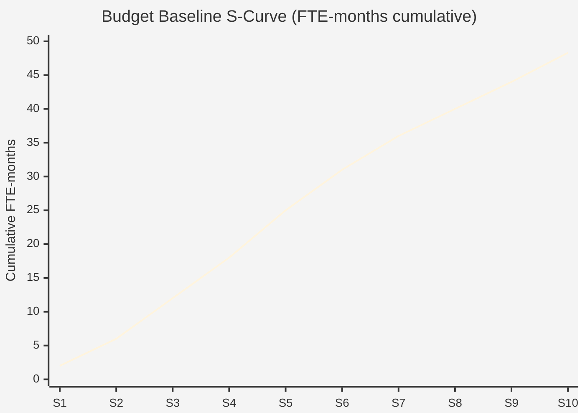

# Budget Baseline — Acme Corp Platform Modernization

**Project**: Platform Modernization | **Date**: 2026-Q1 | **Baseline Version**: 1.0

## TL;DR

Total budget baseline: 42 FTE-months. Contingency reserve: 6.3 FTE-months (15%). Management reserve: 4.2 FTE-months (10%). Confidence level: P70. Peak spending in Sprints 5-10.

## Budget Summary

| Category | FTE-Months | Percentage | Evidence |
|----------|-----------|------------|----------|
| Development | 24.0 | 57% | Bottom-up estimate from WBS [METRIC] |
| Architecture & Design | 6.0 | 14% | Parametric estimate [PLAN] |
| QA & Testing | 5.5 | 13% | Historical ratio 23% of dev [METRIC] |
| Project Management | 4.0 | 10% | 1 PM full-time, 10 sprints [SCHEDULE] |
| DevOps & Infrastructure | 2.5 | 6% | Parametric from similar projects [INFERENCIA] |
| **Subtotal (BAC)** | **42.0** | **100%** | |
| Contingency Reserve | 6.3 | 15% of BAC | Risk-based calculation [PLAN] |
| **Performance Measurement Baseline** | **48.3** | | |
| Management Reserve | 4.2 | 10% of BAC | Sponsor-approved [STAKEHOLDER] |
| **Total Project Budget** | **52.5** | | |

## Work Package Detail

| WP | Description | Estimate | Method | Confidence |
|----|-------------|----------|--------|------------|
| WP-1.1 | API Gateway Development | 4.0 FTE-mo | Bottom-up | High [METRIC] |
| WP-1.2 | Microservices Migration | 8.0 FTE-mo | Bottom-up | Medium [PLAN] |
| WP-1.3 | Database Modernization | 5.0 FTE-mo | Parametric | Medium [INFERENCIA] |
| WP-2.1 | Frontend Rebuild | 7.0 FTE-mo | Bottom-up | High [METRIC] |
| WP-3.1 | Integration Testing | 3.5 FTE-mo | Historical ratio | High [METRIC] |
| WP-3.2 | Performance Testing | 2.0 FTE-mo | Expert judgment | Low [SUPUESTO] |

## S-Curve Visualization

## Contingency Allocation

| Risk ID | Risk Description | Contingency | Trigger |
|---------|-----------------|-------------|---------|
| R-003 | Database migration complexity | 2.0 FTE-mo | Schema incompatibility discovered [PLAN] |
| R-007 | Third-party API changes | 1.5 FTE-mo | Vendor deprecation notice [SCHEDULE] |
| R-012 | Team attrition mid-project | 1.8 FTE-mo | Key resource departure [STAKEHOLDER] |
| R-015 | Performance requirements gap | 1.0 FTE-mo | Load test failure [METRIC] |

## Baseline Assumptions

| ID | Assumption | Impact if False |
|----|-----------|----------------|
| BA-01 | Team velocity stable at 30 SP/sprint | Re-baseline required [SUPUESTO] |
| BA-02 | Cloud infrastructure costs included in ops budget | 3-5 FTE-mo additional [PLAN] |
| BA-03 | No regulatory scope additions | Up to 8 FTE-mo impact [SUPUESTO] |

*PMO-APEX v1.0 — Sample Output · Budget Baseline*
