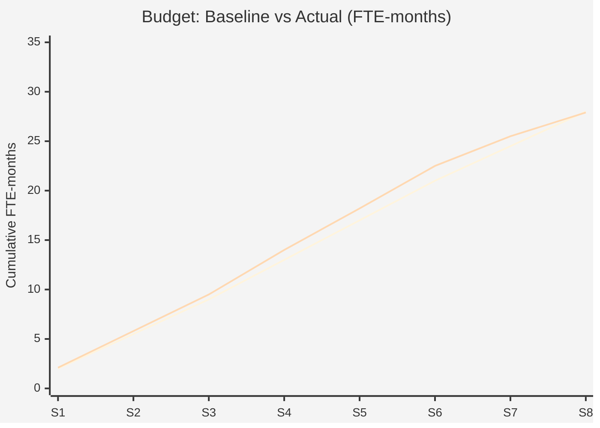

# Budget Tracking Report — Acme Corp, Sprint 8

**Project**: Platform Modernization | **Sprint**: 8 of 12 | **Report Date**: 2026-03-14

## TL;DR

Project is 5.2% over budget (CPI = 0.95). Primary driver: unplanned database migration complexity. EAC forecast: 44.2 FTE-months vs. 42.0 BAC. Corrective action: reduce scope of Phase 2 non-critical features to recover 2.5 FTE-months.

## Budget Dashboard

| Metric | Value | Status | Evidence |
|--------|-------|--------|----------|
| Budget at Completion (BAC) | 42.0 FTE-mo | Baseline | Approved baseline v1.0 [PLAN] |
| Planned Value (PV) | 28.0 FTE-mo | 67% planned | Schedule baseline [SCHEDULE] |
| Earned Value (EV) | 26.5 FTE-mo | 63% complete | Work completion data [METRIC] |
| Actual Cost (AC) | 27.9 FTE-mo | 66% spent | Time tracking + actuals [METRIC] |
| Cost Variance (CV) | -1.4 FTE-mo | Over budget | EV - AC [METRIC] |
| Cost Performance Index (CPI) | 0.95 | Amber | EV / AC [METRIC] |
| Schedule Performance Index (SPI) | 0.95 | Amber | EV / PV [SCHEDULE] |
| Estimate at Completion (EAC) | 44.2 FTE-mo | +5.2% | BAC / CPI [METRIC] |

## S-Curve (Baseline vs. Actual)

## Variance Analysis

| Work Package | Planned | Actual | Variance | Root Cause |
|-------------|---------|--------|----------|------------|
| WP-1.3 Database Modernization | 5.0 | 6.5 | -1.5 | Schema complexity underestimated [INFERENCIA] |
| WP-2.1 Frontend Rebuild | 7.0 | 6.8 | +0.2 | Efficient component reuse [METRIC] |
| WP-1.2 Microservices | 8.0 | 8.1 | -0.1 | Minor integration delays [SCHEDULE] |

## EAC Scenarios

| Scenario | EAC | Assumption |
|----------|-----|-----------|
| Optimistic | 43.4 FTE-mo | Remaining work at original estimates [PLAN] |
| Most Likely | 44.2 FTE-mo | Current CPI continues [METRIC] |
| Pessimistic | 46.8 FTE-mo | CPI and SPI both continue [INFERENCIA] |

## Corrective Actions

| Action | Savings | Risk | Owner |
|--------|---------|------|-------|
| Defer non-critical Phase 2 features | 2.5 FTE-mo | Scope reduction, stakeholder impact [STAKEHOLDER] |
| Parallelize DB migration tasks | 0.5 FTE-mo | Quality risk from speed [INFERENCIA] |
| Optimize QA with automation | 0.3 FTE-mo | Setup investment needed [PLAN] |

*PMO-APEX v1.0 — Sample Output · Budget Tracking*
