# Capacity Plan — Acme Corp Engineering, Q2 2026

**Period**: April-June 2026 | **Teams**: 3 squads | **Total FTE**: 18

## TL;DR

Total Q2 capacity: 41.4 FTE-months (after adjustments). Demand: 48 FTE-months. Gap: 6.6 FTE-months. Recommendations: defer 2 low-priority features, hire 1 backend engineer, leverage contractor pool for testing.

## Capacity Calculation

| Factor | Squad Alpha | Squad Beta | Squad Gamma | Total |
|--------|-----------|-----------|------------|-------|
| Raw FTE-months | 18.0 | 15.0 | 15.0 | 48.0 |
| PTO/Holidays (-12%) | -2.2 | -1.8 | -1.8 | -5.8 |
| Meeting overhead (-15%) | -2.4 | -2.0 | -2.0 | -6.3 |
| Focus factor (0.85) | Included | Included | Included | -- |
| **Adjusted capacity** | **13.5** | **11.2** | **11.2** | **41.4** |

## Demand vs. Capacity

```mermaid
%%{init: {'theme': 'base', 'themeVariables': {'primaryColor': '#2563EB'}}}%%
xychart-beta
    title "Q2 Capacity vs Demand (FTE-months)"
    x-axis ["Alpha", "Beta", "Gamma"]
    y-axis "FTE-months" 0 --> 20
    bar [13.5, 11.2, 11.2]
    bar [16.0, 15.0, 17.0]
```

## Allocation Matrix

| Resource | Squad | Project A | Project B | Maintenance | Buffer | Total |
|----------|-------|-----------|-----------|-------------|--------|-------|
| Lead Dev 1 | Alpha | 80% | -- | 10% | 10% | 100% |
| Dev 2 | Alpha | 60% | 20% | 10% | 10% | 100% |
| Dev 3 | Beta | -- | 80% | 10% | 10% | 100% |
| QA Lead | Gamma | 40% | 40% | 10% | 10% | 100% |

## Gap Analysis

| Skill Gap | Demand | Supply | Delta | Resolution |
|-----------|--------|--------|-------|------------|
| Backend (Java) | 8 FTE-mo | 5.5 FTE-mo | -2.5 | Hire 1 engineer (1 month ramp) [PLAN] |
| QA Automation | 4 FTE-mo | 2 FTE-mo | -2.0 | Contractor from pool [SCHEDULE] |
| Frontend (React) | 6 FTE-mo | 5 FTE-mo | -1.0 | Cross-train Dev 4 [STAKEHOLDER] |

## Recommendations

| Priority | Action | Impact | Timeline |
|----------|--------|--------|----------|
| P1 | Defer Feature X and Y to Q3 | Reduces demand by 4 FTE-mo [PLAN] | Immediate |
| P1 | Activate contractor for QA | Adds 2 FTE-mo capacity [SCHEDULE] | 2 weeks |
| P2 | Hire backend engineer | Adds 2 FTE-mo (after ramp) [PLAN] | 6 weeks |
| P3 | Reduce meeting overhead to 12% | Recovers 1.4 FTE-mo [METRIC] | 4 weeks |

*PMO-APEX v1.0 — Sample Output · Capacity Planning*
