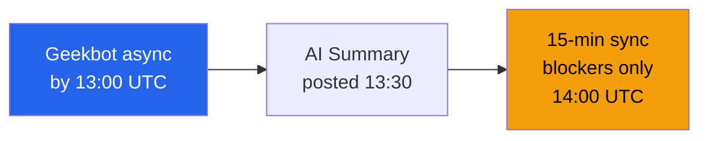

# Ceremony Suite Design — Acme Corp, Squad Phoenix (Remote)

**Team**: 7 members | **Framework**: Scrum | **Mode**: Fully remote | **Sprint**: 2 weeks

## TL;DR

6 ceremonies designed for remote-first delivery. Total ceremony time: 16% of sprint capacity (target: <20%). Async components reduce sync time by 35% vs. standard Scrum.

## Ceremony Calendar

| Day | Time (UTC) | Ceremony | Duration | Format |
|-----|-----------|---------|----------|--------|
| Monday (Sprint start) | 14:00 | Sprint Planning | 2 hours | Sync video [SCHEDULE] |
| Daily | 14:00 | Standup | 15 min | Async (Geekbot) + 15 min sync [METRIC] |
| Wednesday | 15:00 | Backlog Refinement | 1 hour | Sync video [PLAN] |
| Friday (Sprint end) | 14:00 | Sprint Review | 1 hour | Sync video + demo [STAKEHOLDER] |
| Friday (Sprint end) | 15:30 | Retrospective | 1 hour | Async prep + sync [METRIC] |
| Monthly | 14:00 | Ceremony Health Check | 30 min | Async survey + sync discussion [PLAN] |

## Ceremony Designs

### Daily Standup (Async-First)

- **Async prompt**: What I completed / What I plan today / Blockers
- **Sync focus**: Only discuss blockers and dependencies
- **Time saved**: 50% vs. traditional 15-min daily standup [METRIC]

### Retrospective (Rotating Formats)

| Sprint | Format | Energy Required | Best For |
|--------|--------|----------------|----------|
| 1 | Start-Stop-Continue | Low | Baseline gathering [STAKEHOLDER] |
| 2 | 4Ls (Liked, Learned, Lacked, Longed For) | Medium | Emotional processing [STAKEHOLDER] |
| 3 | Sailboat | Medium | Goal-oriented reflection [PLAN] |
| 4 | Lean Coffee | High | Team-directed exploration [STAKEHOLDER] |

## Effectiveness Metrics

| Metric | Target | Measurement |
|--------|--------|------------|
| Ceremony satisfaction | >7.5/10 | Post-ceremony pulse (monthly) [STAKEHOLDER] |
| Action completion rate | >80% | Tracked in Jira [METRIC] |
| Total ceremony time | <16% sprint | Calendar analysis [SCHEDULE] |
| Stakeholder attendance (Review) | >90% | Attendance log [STAKEHOLDER] |

*PMO-APEX v1.0 — Sample Output · Ceremony Design*
