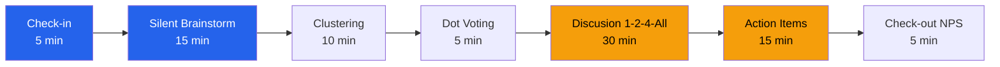

# Guia de Facilitacion — Sprint Retrospective Sprint 8
## Proyecto: Acme Corp ERP Migration

**Fecha**: 2026-03-14 | **Duracion**: 90 min | **Formato**: Virtual (Zoom + Miro)
**Facilitador**: Maria Lopez | **Equipo**: 10 personas

---

## TL;DR
Guia de facilitacion para la retrospectiva del Sprint 8 usando formato "Starfish" con tecnicas de engagement para participacion equitativa en formato virtual. Historico: NCS Sprint 7 fue 6.2 con formato repetitivo; objetivo es >7.0. [PLAN]

## Agenda Facilitada

| Bloque | Actividad | Duracion | Facilitacion |
|--------|-----------|----------|--------------|
| 1 | Check-in: "Una palabra que describe tu sprint" | 5 min | Round-robin por orden alfabetico |
| 2 | Silent brainstorming en Miro (Starfish) | 15 min | Timer visible, musica de fondo |
| 3 | Clustering y lectura grupal | 10 min | Facilitador lee clusters, grupo valida |
| 4 | Dot voting (3 votos por persona) | 5 min | Votacion anonima en Miro |
| 5 | Discusion top 3 temas (1-2-4-All) | 30 min | 10 min por tema |
| 6 | Action items con owners y deadlines | 15 min | Asignacion en vivo |
| 7 | Check-out: Ceremony NPS (1-10) | 5 min | Poll anonimo en Zoom |
| -- | Buffer | 5 min | Overflow |

## Tecnicas de Engagement

### Tecnica Principal: 1-2-4-All
1. **1 min** — Reflexion individual silenciosa
2. **2 min** — Discusion en parejas (breakout rooms de 2)
3. **4 min** — Grupos de 4 (merge breakout rooms)
4. **3 min** — All: cada grupo comparte 1 insight clave

### Tecnica Alternativa: Brainwriting 6-3-5
Si participacion es baja, cambiar a brainwriting: 6 personas, 3 ideas, 5 minutos por ronda en Miro. [PLAN]

## Protocolo de Conflicto

| Escenario | Respuesta del Facilitador |
|-----------|---------------------------|
| Discusion personal | "Enfoquemonos en el proceso, no en las personas. Que podemos cambiar?" |
| Miembro domina | "Gracias. Usemos round-robin para escuchar todas las perspectivas." |
| Silencio prolongado | "2 minutos para escribir en Miro antes de discutir." |
| Emocion intensa | "Reconozco la frustracion. Tomemos 2 min de pausa y retomemos." |

## Metricas de Efectividad

| Metrica | Objetivo | Medicion |
|---------|----------|----------|
| Participation Index | >80% | Personas que hablaron / Total [METRIC] |
| Ceremony NPS | >7.0 | Poll anonimo al cierre [METRIC] |
| Action Items | ≥3 con owners | Conteo en Miro [PLAN] |
| Action Completion (Sprint 9) | >70% | Tracking en siguiente retro [METRIC] |

## Decision Protocol
Consentimiento: acciones aprobadas si nadie tiene objecion fundamentada. Si hay objecion, discusion de 5 min y voto por mayoria simple. [DECISION]

## Materiales

- [ ] Miro board con template Starfish preparado
- [ ] Breakout rooms pre-configurados en Zoom
- [ ] Timer visible (cuckoo.team)
- [ ] Poll anonimo configurado
- [ ] Template de action items en documento compartido

## Supuestos y Riesgos
- [SUPUESTO] Todos los miembros tienen acceso a Miro y Zoom
- [SUPUESTO] El equipo tiene madurez para feedback honesto
- [PLAN] Si Miro falla, usar Google Jamboard como contingencia
- [PLAN] Si un miembro no puede asistir, enviar formulario asincrono pre-sesion

*PMO-APEX v1.0 — Sample Output - Ceremony Facilitation*
