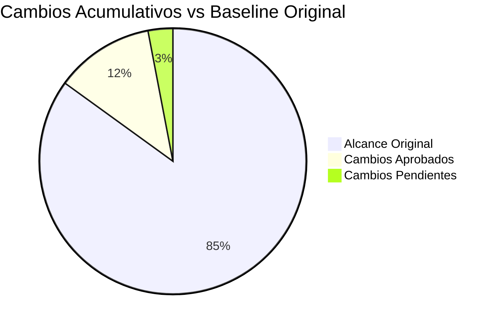

# Minuta CCB — Acme Corp ERP Migration
## Reunion CCB-008

**Fecha**: 2026-03-14 | **Duracion**: 45 min | **Chair**: Sarah Chen (Sponsor)

---

## TL;DR
3 solicitudes revisadas. CR-021 aprobada (parche de seguridad, 0.5 sprint). CR-022 aprobada con condiciones (nuevo API endpoint, 1.5 sprints). CR-023 diferida (migracion de proveedor de pagos, 4 sprints). Impacto acumulativo: 8.3% sobre baseline original. [DECISION]

## Asistencia

| Miembro | Rol | Presente | Voto |
|---------|-----|----------|------|
| Sarah Chen | Sponsor | Si | Chair [STAKEHOLDER] |
| Marcus Rivera | Project Manager | Si | Consultivo [PLAN] |
| Priya Patel | Lider Tecnico | Si | Voto pleno [METRIC] |
| James Wilson | Product Owner | Si | Voto pleno [STAKEHOLDER] |
| Lisa Kim | Lider QA | Si | Voto pleno [METRIC] |

## Decisiones

### CR-021: Parche de Vulnerabilidad de Seguridad — APROBADA

| Campo | Detalle |
|-------|---------|
| Categoria | Emergencia [SCHEDULE] |
| Descripcion | Parche CVE-2026-1234 en modulo de autenticacion |
| Impacto | 0.5 sprint de esfuerzo adicional, sin cambio de alcance [METRIC] |
| Presupuesto | 1.5 FTE-meses de reserva de contingencia [PLAN] |
| Riesgo | Bajo — parche proporcionado por vendor [METRIC] |
| Decision | **Aprobada por unanimidad** [DECISION] |
| Condicion | Deploy a staging en 48h, produccion en 1 semana [SCHEDULE] |

### CR-022: Nuevo API Endpoint para Integracion — APROBADA CON CONDICIONES

| Campo | Detalle |
|-------|---------|
| Categoria | Moderado [PLAN] |
| Descripcion | Agregar endpoint REST para sincronizacion de datos con socio |
| Impacto | 1.5 sprints, 3 FTE-meses [METRIC] |
| Presupuesto | Financiado por trade-off de alcance (diferir Feature Y) [PLAN] |
| Riesgo | Medio — nuevo punto de integracion aumenta complejidad [INFERENCIA] |
| Decision | **Aprobada 3-1** (QA disintio: preocupacion de cobertura de testing) [DECISION] |
| Condiciones | 1. Suite de tests API requerida 2. Feature Y diferida a Fase 2 [SCHEDULE] |

### CR-023: Migracion de Proveedor de Pagos — DIFERIDA

| Campo | Detalle |
|-------|---------|
| Categoria | Mayor [PLAN] |
| Descripcion | Cambiar de PaymentCo a StripePay |
| Impacto | 4 sprints, 8 FTE-meses [METRIC] |
| Presupuesto | Excede contingencia; requiere reserva gerencial [STAKEHOLDER] |
| Riesgo | Alto — afecta ruta critica de pagos [INFERENCIA] |
| Decision | **Diferida** — Requiere analisis comparativo de vendors y POC [DECISION] |
| Accion | PM entrega analisis comparativo para Sprint 10 [SCHEDULE] |

## Dashboard de Impacto Acumulativo

| Metrica | Original | Post CR-021+022 | Cambio % |
|---------|----------|-----------------|----------|
| Alcance (story points) | 340 | 362 | +6.5% [METRIC] |
| Cronograma (sprints) | 12 | 13 | +8.3% [SCHEDULE] |
| Presupuesto (FTE-meses) | 42 | 45.5 | +8.3% [METRIC] |

**Nota**: Impacto acumulativo en 8.3%. Umbral de alerta: 20%. Estado: Verde. [METRIC]

## Proxima Sesion

**Fecha**: 2026-03-28 | **Agenda**: Re-revision CR-023 con resultados del POC

*PMO-APEX v1.0 — Sample Output - Change Control Board*
