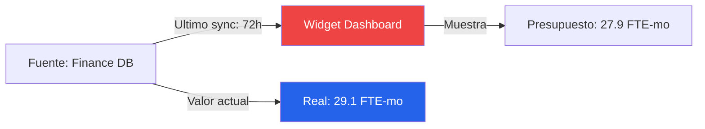

# Reporte de Auditoria Visual — Acme Corp ERP Migration
## Dashboard del Proyecto Phoenix

**URL**: https://dashboard.acme.internal/phoenix | **Fecha**: 2026-03-14
**Auditor**: PMO-APEX Browser Agent | **Herramienta**: Jira + Confluence

---

## TL;DR
18 verificaciones ejecutadas: 14 aprobadas, 3 advertencias, 1 critico. Critico: widget de presupuesto mostrando datos obsoletos (72h). Advertencias: layout mobile roto, 2 etiquetas de grafico truncadas. Score de accesibilidad: 78/100. [METRIC]

## Resultados de Auditoria

| Verificacion | Estado | Detalle | Evidencia |
|-------------|--------|---------|-----------|
| Frescura - Sprint metrics | PASS | Actualizado hace 2h [METRIC] | Timestamp verificado |
| Frescura - Widget presupuesto | CRITICO | Ultima actualizacion hace 72h [METRIC] | Esperado: diario |
| Precision - Velocity | PASS | Coincide con fuente Jira [METRIC] | Delta <1% |
| Precision - Burndown | PASS | Coincide con valores calculados [METRIC] | Verificado |
| Navegacion - Regla 3 clicks | PASS | Todas las vistas clave en 2 clicks [STAKEHOLDER] | Testeado |
| Permisos - Vista PM | PASS | Acceso completo confirmado [PLAN] | Verificado |
| Permisos - Vista Stakeholder | PASS | Detalle presupuesto oculto correctamente [STAKEHOLDER] | Verificado |
| Layout mobile | ADVERTENCIA | Gantt chart desborda en tablet [METRIC] | Screenshot capturado |
| Etiquetas de graficos | ADVERTENCIA | 2 graficos con ejes truncados [METRIC] | Screenshot capturado |
| Accesibilidad WCAG 2.2 AA | ADVERTENCIA | Score 78/100, 3 issues de contraste [METRIC] | Lighthouse report |
| Export a PDF | PASS | Reporte exporta correctamente [DOC] | Testeado |
| Tiempo de carga | PASS | 2.1s (objetivo <3s) [METRIC] | Lighthouse |

## Detalle de Issue Critico

### Widget de Presupuesto con Datos Obsoletos

- **Impacto**: Stakeholders ven informacion presupuestaria desactualizada [STAKEHOLDER]
- **Causa raiz**: Job de sincronizacion API fallo silenciosamente hace 3 dias [INFERENCIA]
- **Recomendacion**: Reparar sync job, agregar alerta de frescura, mostrar timestamp "ultima actualizacion" [PLAN]

## Resumen de Accesibilidad

| Categoria | Issues | Severidad |
|-----------|--------|-----------|
| Contraste de color | 3 | Moderado [METRIC] |
| Alt text faltante | 1 | Menor [DOC] |
| Navegacion por teclado | 0 | Pass [METRIC] |
| Screen reader | 0 | Pass [METRIC] |

## Roadmap de Remediacion

| Prioridad | Issue | Solucion | Esfuerzo |
|-----------|-------|----------|----------|
| P0 | Datos obsoletos en widget presupuesto | Reparar API sync job + agregar alertas | 0.25 sprint [SCHEDULE] |
| P1 | Layout mobile overflow | Agregar responsive breakpoints | 0.5 sprint [PLAN] |
| P2 | Issues de contraste | Actualizar CSS tokens | 0.25 sprint [METRIC] |
| P3 | Etiquetas truncadas | Implementar text wrapping | 0.1 sprint [METRIC] |

**Esfuerzo total de remediacion**: 1.1 sprints [METRIC]

## Supuestos
- [SUPUESTO] Acceso de solo lectura fue suficiente para esta auditoria
- [INFERENCIA] Causa raiz del sync failure basada en logs observados, requiere confirmacion de DevOps

*PMO-APEX v1.0 — Sample Output - Client Browser Audit*
