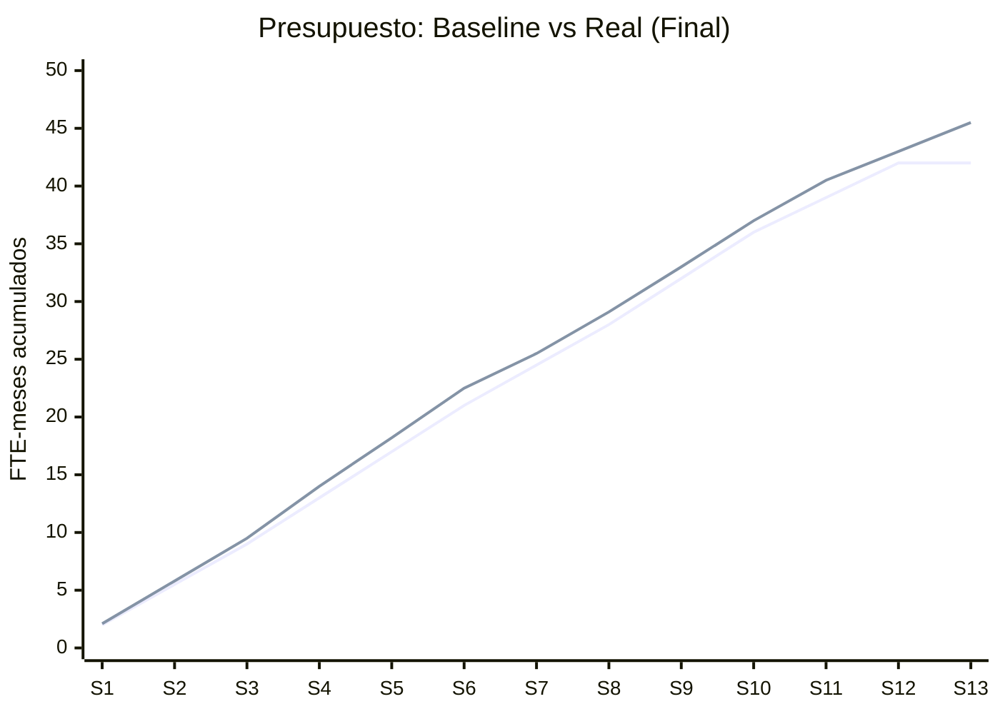

# Reporte de Cierre — Acme Corp ERP Migration
## Proyecto Phoenix — Modernizacion de Plataforma

**Proyecto**: Modernizacion de Microservicios | **Duracion**: 13 sprints | **Fecha**: 2026-03-14

---

## TL;DR
Proyecto Phoenix entrego plataforma de microservicios reemplazando monolito legacy. Completado 1 sprint sobre cronograma y 8.3% sobre presupuesto. 95% de criterios de aceptacion cumplidos. Satisfaccion stakeholders: 8.2/10. Leccion clave: complejidad de migracion de base de datos sistematicamente subestimada. [PLAN]

## Resumen de Performance

| Dimension | Planificado | Real | Varianza | Estado |
|-----------|------------|------|----------|--------|
| Duracion | 12 sprints | 13 sprints | +8.3% | Amarillo [SCHEDULE] |
| Presupuesto | 42 FTE-mo | 45.5 FTE-mo | +8.3% | Amarillo [METRIC] |
| Alcance | 340 SP | 362 SP (+22 de CRs) | +6.5% | Verde [PLAN] |
| Calidad | <5% defect escape | 3.2% defect escape | -1.8% | Verde [METRIC] |
| Satisfaccion | >7.5/10 | 8.2/10 | +0.7 | Verde [STAKEHOLDER] |

## Aceptacion de Entregables

| Entregable | Estado | Aceptado Por | Fecha |
|-----------|--------|-------------|-------|
| API Gateway | Aceptado | Lider Tecnico | 2026-02-28 [METRIC] |
| 12 Microservicios | Aceptado | Architecture Board | 2026-03-07 [METRIC] |
| Frontend SPA | Aceptado | Product Owner | 2026-03-10 [STAKEHOLDER] |
| Migracion de Datos | Aceptado con condiciones | DBA Lead | 2026-03-12 [METRIC] |
| Documentacion | Aceptado | Lider Tecnico | 2026-03-14 [DOC] |

## Metricas EVM Finales

| Metrica EVM | Valor | Interpretacion |
|-------------|-------|----------------|
| SPI Final | 0.92 | 8% atrasado [SCHEDULE] |
| CPI Final | 0.92 | 8% sobre presupuesto [METRIC] |
| VAC | -3.5 FTE-mo | Sobre-costo final [METRIC] |

## Lecciones Aprendidas (Top 5)

| # | Categoria | Leccion | Recomendacion | Aplicabilidad |
|---|-----------|---------|---------------|---------------|
| 1 | Tecnico | Complejidad de migracion DB 60% mayor a estimada | Usar estimaciones validadas por PoC para migraciones; agregar 50% buffer para complejidad de schema | Todos los proyectos de migracion [METRIC] |
| 2 | Proceso | Syncs semanales con DBA previnieron 80% de conflictos de schema post-Sprint 4 | Mandatar syncs semanales cross-equipo para dependencias de recursos compartidos | Proyectos multi-equipo [PLAN] |
| 3 | Personas | 2 miembros onboarded mid-proyecto necesitaron 3 sprints para velocidad completa | Presupuestar ramp-up de 3 sprints para adiciones mid-proyecto en planes de capacidad | Todos los proyectos [STAKEHOLDER] |
| 4 | Herramientas | Suite de regression automatizada ahorro 2 FTE-meses en testing | Invertir en test automation en Sprint 1-2, no como afterthought | Proyectos de software [METRIC] |
| 5 | Gobernanza | CCB escalonado (autoridad PM para cambios <5%) redujo latencia de decision | Implementar autoridad de cambio escalonada en todos los proyectos | Todos los proyectos [PLAN] |

## Estado de Beneficios

| Beneficio | Target | Estado Actual | Fecha Realizacion |
|-----------|--------|--------------|-------------------|
| Tiempo respuesta API <200ms | 180ms logrado | Realizado [METRIC] | En go-live |
| Frecuencia deploy diaria | 3/semana actual | Parcial [SCHEDULE] | +3 meses |
| Onboarding dev <1 semana | No medido aun | Pendiente [SUPUESTO] | +6 meses |

## Cierre Administrativo

- [x] Todos los contratos cerrados
- [x] Recursos liberados a resource pool
- [x] Artefactos archivados en Confluence
- [x] Lecciones ingresadas en knowledge base organizacional
- [x] Aceptacion firmada por sponsor
- [ ] Revision de beneficios a 6 meses agendada (2026-09-14) [SCHEDULE]

*PMO-APEX v1.0 — Sample Output - Closure Report*
