# Communication Plan — Acme Corp, Project Phoenix

**Project**: Platform Modernization | **Date**: 2026-Q1 | **Owner**: PM

## TL;DR

5 stakeholder groups, 8 communication touchpoints, 3 channels. Async-first approach with sync meetings for decisions only. Weekly communication load: 4 hours PM time.

## Communication Matrix

| Stakeholder | Info Need | Channel | Frequency | Format | Owner |
|-------------|----------|---------|-----------|--------|-------|
| CEO/Sponsor | Strategic status, decisions | Email + 1:1 | Bi-weekly | 1-page executive brief [STAKEHOLDER] | PM |
| Steering Committee | Gate reviews, governance | Video meeting | Monthly | Presentation deck [STAKEHOLDER] | PM |
| Product Owner | Sprint progress, backlog health | Slack + Sprint Review | Per sprint | Demo + metrics [PLAN] | Scrum Master |
| Development Team | Technical decisions, blockers | Slack + Daily Standup | Daily | Informal updates [SCHEDULE] | Tech Lead |
| PMO | Portfolio metrics, risk flags | Dashboard | Weekly (automated) | Dashboard link [METRIC] | PM (automated) |

## Communication Calendar

```mermaid
gantt
    title Weekly Communication Schedule
    dateFormat HH:mm
    axisFormat %H:%M
    section Monday
    Team Standup       :a1, 09:00, 15m
    section Tuesday
    Team Standup       :b1, 09:00, 15m
    section Wednesday
    Team Standup       :c1, 09:00, 15m
    Sponsor Brief      :c2, 14:00, 30m
    section Thursday
    Team Standup       :d1, 09:00, 15m
    Backlog Refinement :d2, 14:00, 60m
    section Friday
    Team Standup       :e1, 09:00, 15m
    Sprint Review      :e2, 14:00, 60m
```

## Escalation Matrix

| Severity | First Contact | Escalation | Timeline |
|----------|--------------|-----------|----------|
| Low | PM | None | Normal cadence [SCHEDULE] |
| Medium | PM | Sponsor | Within 24h [SCHEDULE] |
| High | PM + Sponsor | Steering Committee | Within 4h [SCHEDULE] |
| Critical | PM + Sponsor + CTO | Emergency meeting | Within 1h [STAKEHOLDER] |

## Communication Templates

| Template | Used For | Location |
|----------|---------|----------|
| Executive Brief | Sponsor bi-weekly update | `/templates/exec-brief.md` |
| Sprint Report | Sprint review summary | `/templates/sprint-report.md` |
| Risk Alert | Risk escalation notification | `/templates/risk-alert.md` |
| Decision Request | CCB or sponsor decisions | `/templates/decision-request.md` |

*PMO-APEX v1.0 — Sample Output · Communication Plan*
