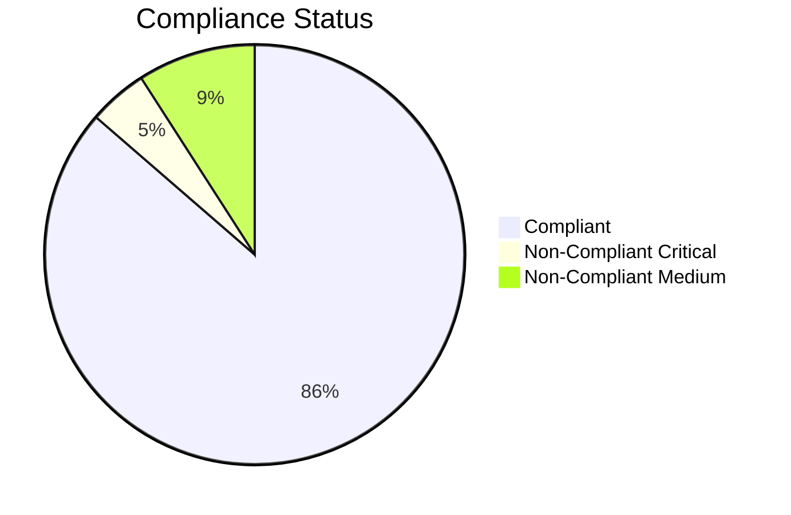

# Compliance Tracking Report — Acme Corp, Project Phoenix

**Date**: 2026-Q1 | **Overall Compliance**: 87% | **Critical Non-Compliance**: 1

## TL;DR

22 requirements tracked across 4 domains. 87% compliant. 1 critical gap: GDPR data retention policy not implemented. 2 medium gaps in accessibility. All security requirements compliant.

## Compliance Dashboard

| Domain | Requirements | Compliant | Non-Compliant | Percentage |
|--------|-------------|-----------|--------------|------------|
| Data Protection (GDPR) | 8 | 6 | 2 | 75% [METRIC] |
| Security (ISO 27001) | 6 | 6 | 0 | 100% [METRIC] |
| Accessibility (WCAG 2.2) | 5 | 3 | 2 | 60% [METRIC] |
| Contractual (SLAs) | 3 | 3 | 0 | 100% [METRIC] |

## Non-Compliance Items

| ID | Requirement | Domain | Severity | Status | Remediation | Owner |
|----|-------------|--------|----------|--------|-------------|-------|
| NC-001 | Data retention policy implementation | GDPR Art. 5 | Critical | In Progress | Implement automated retention rules | DBA Lead [SCHEDULE] |
| NC-002 | Alt text on dashboard charts | WCAG 2.2 | Medium | Open | Add alt attributes to all chart elements | Frontend Dev [PLAN] |
| NC-003 | Color contrast ratio 4.5:1 | WCAG 2.2 | Medium | Open | Update CSS color tokens | Frontend Dev [PLAN] |

## Remediation Plan

| Priority | Item | Effort | Target Date | Status |
|----------|------|--------|------------|--------|
| P0 | GDPR retention policy | 1 sprint | 2026-04-01 | In progress [SCHEDULE] |
| P1 | Alt text remediation | 0.5 sprint | 2026-04-15 | Not started [PLAN] |
| P1 | Color contrast fix | 0.25 sprint | 2026-04-15 | Not started [PLAN] |

*PMO-APEX v1.0 — Sample Output · Compliance Tracking*
