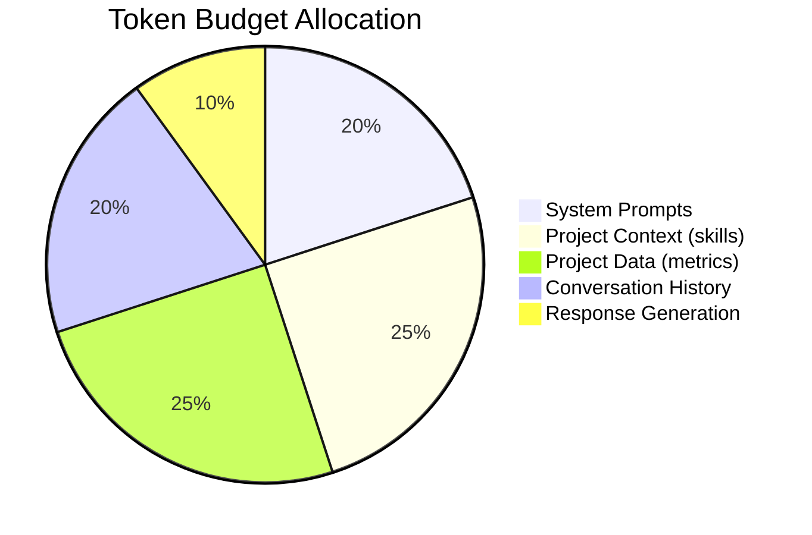

# Context Loading Manifest — Acme Corp, Sprint 8 Session

**Project**: Platform Modernization | **Phase**: Execution | **Task**: Sprint Budget Review

## TL;DR
Optimized context loading for sprint budget review: 4 skills at L2, 2 at L1, remainder unloaded. Total estimated tokens: 3,200 (vs. 12,000 for full load). 73% token savings.

## Loading Strategy

| Skill | Level | Tokens | Justification |
|-------|-------|--------|---------------|
| budget-tracking | L2 Core | 800 | Primary skill for task [PLAN] |
| earned-value-analysis | L2 Core | 750 | EVM calculations needed [METRIC] |
| budget-baseline | L2 Core | 700 | Baseline reference needed [PLAN] |
| executive-dashboard | L2 Core | 650 | Report format needed [STAKEHOLDER] |
| cost-estimation | L1 Metadata | 100 | Reference only if variance investigation needed [PLAN] |
| change-control-board | L1 Metadata | 100 | Reference only if re-baseline needed [PLAN] |
| Other 94 skills | Not loaded | 0 | Not relevant to current task |
| **Total** | | **3,100** | **73% savings vs. full load** |

## Context Budget Allocation

## Escalation Triggers

| Trigger | Action | Additional Tokens |
|---------|--------|-----------------|
| Variance >10% | Load cost-estimation L2 | +600 [PLAN] |
| Re-baseline needed | Load change-control-board L2 | +700 [PLAN] |
| Stakeholder question | Load communication-plan L1 | +100 [STAKEHOLDER] |

*PMO-APEX v1.0 — Sample Output · Context Optimization*
