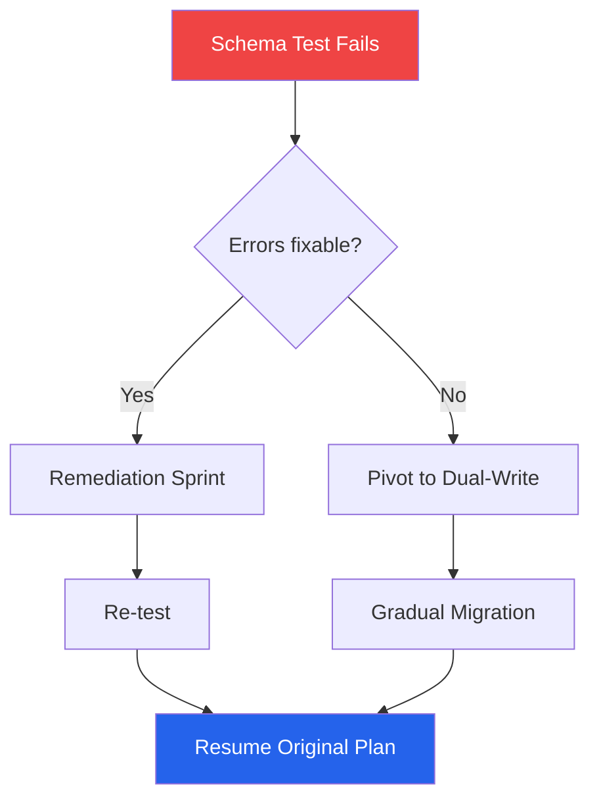

# Contingency Plans — Acme Corp, Project Phoenix Top 5 Risks

**Project**: Platform Modernization | **Date**: 2026-Q1

## TL;DR
5 contingency plans developed for top risks. Total contingency reserve: 6.3 FTE-months. 2 plans tested via tabletop exercise. All plans have assigned owners and defined triggers.

## Contingency Plan Summary

| Risk | Probability | Impact | Trigger | Reserve | Owner |
|------|-----------|--------|---------|---------|-------|
| R-003 Database migration failure | High | High | Schema test fails | 2.0 FTE-mo | DBA Lead [PLAN] |
| R-007 Vendor API deprecation | Medium | High | Deprecation notice | 1.5 FTE-mo | Tech Lead [SCHEDULE] |
| R-012 Key developer departure | Medium | High | Resignation notice | 1.8 FTE-mo | PM [STAKEHOLDER] |
| R-015 Performance requirements miss | Low | High | Load test failure | 1.0 FTE-mo | DevOps Lead [METRIC] |
| R-018 Regulatory requirement change | Low | Medium | Regulation published | 0.5 FTE-mo | Compliance Officer [DOC] |

## Detailed Plan: R-003 Database Migration Failure

**Trigger**: Schema compatibility test fails with >10 critical errors [METRIC]

**Response Actions**:
1. Activate DBA specialist from contractor pool (Day 1) [PLAN]
2. Run diagnostic on failed schemas (Day 1-2) [METRIC]
3. If fixable: remediation sprint with specialist (Sprint N+1) [SCHEDULE]
4. If not fixable: pivot to dual-write pattern with gradual migration (Sprint N+1 to N+3) [PLAN]

**Resources**: 2.0 FTE-months from contingency reserve, DBA specialist on retainer [PLAN]

**Decision Authority**: Tech Lead activates; PM approves reserve draw [STAKEHOLDER]

**Communication**: Notify sponsor within 4 hours; team briefing within 24 hours [STAKEHOLDER]

## Reserve Tracking

| Reserve Type | Allocated | Used | Remaining | Coverage |
|-------------|----------|------|-----------|----------|
| Contingency | 6.3 FTE-mo | 0 | 6.3 FTE-mo | 100% [METRIC] |
| Management | 4.2 FTE-mo | 0 | 4.2 FTE-mo | 100% [PLAN] |

*PMO-APEX v1.0 — Sample Output · Contingency Planning*
