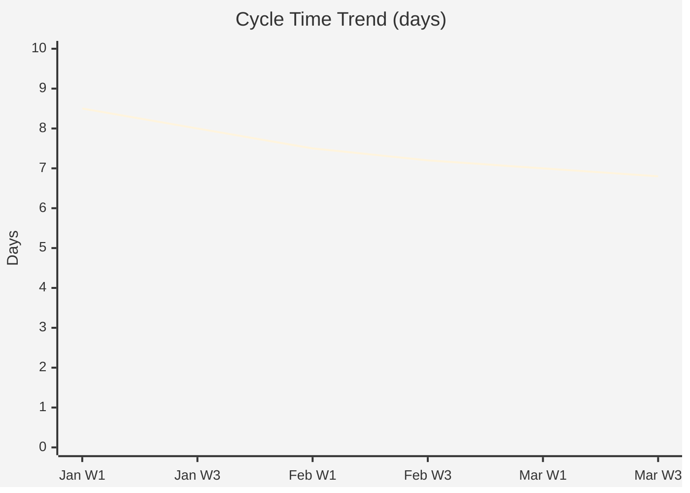

# Quarterly Improvement Report — Acme Corp Engineering, Q1 2026

**Period**: Jan-Mar 2026 | **Teams**: 3 squads | **Improvements Tracked**: 12

## TL;DR
12 improvement experiments run in Q1. 8 showed positive impact and are now permanent. 3 inconclusive (extending). 1 abandoned. Net impact: 15% cycle time reduction, 20% fewer escaped defects.

## Improvement Scorecard

| ID | Improvement | Status | Before | After | ROI |
|----|-----------|--------|--------|-------|-----|
| I-001 | Automated PR reviews | Permanent | 4h review time | 1.5h review time | 10:1 [METRIC] |
| I-002 | Async standup (Geekbot) | Permanent | 15 min/day sync | 5 min/day async | 5:1 [METRIC] |
| I-003 | Pair programming Tuesdays | Permanent | 8% defect rate | 4% defect rate | 3:1 [METRIC] |
| I-004 | Sprint goal focus metric | Extending | 70% goal achievement | 78% goal achievement | TBD [PLAN] |
| I-005 | Meeting-free Wednesdays | Permanent | 25% meeting overhead | 18% meeting overhead | 7:1 [METRIC] |
| I-006 | Feature flags for all releases | Abandoned | High setup cost, low adoption | N/A | Negative [INFERENCIA] |

## Impact Summary

| Metric | Q4 2025 | Q1 2026 | Change | Evidence |
|--------|---------|---------|--------|----------|
| Avg Cycle Time | 8.2 days | 6.9 days | -15% | Flow metrics [METRIC] |
| Defect Escape Rate | 5.0% | 4.0% | -20% | QA metrics [METRIC] |
| Team Satisfaction | 7.2/10 | 7.8/10 | +8% | Pulse survey [STAKEHOLDER] |
| Sprint Goal Achievement | 72% | 80% | +11% | Sprint review data [METRIC] |

## Q2 Improvement Backlog

| Priority | Improvement | Hypothesis | Effort |
|----------|-----------|-----------|--------|
| P1 | Automated regression suite | Will reduce testing time by 50% | 2 sprints [PLAN] |
| P2 | Architecture Decision Records | Will reduce technical debate time by 30% | 0.5 sprint [PLAN] |
| P3 | Cross-team knowledge sharing sessions | Will reduce duplicate problem-solving by 20% | 0.25 sprint [STAKEHOLDER] |

*PMO-APEX v1.0 — Sample Output · Continuous Improvement*
