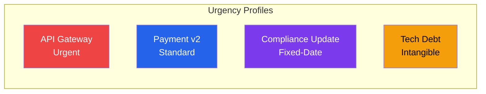

# Cost of Delay Analysis — Acme Corp, Q2 Portfolio Prioritization

**Portfolio**: Digital Products | **Method**: WSJF with quantified CoD | **Items**: 8

## TL;DR
Portfolio resequencing based on WSJF reduces total accumulated CoD by 34% ($2.1M annualized). Top priority shifts from Feature Alpha (stakeholder favorite) to API Gateway (highest CD3). 3 items identified as fragile priorities requiring deeper estimation.

## WSJF Prioritization

| Rank | Item | User Value | Time Crit | RROE | CoD Total | Duration | WSJF | Profile |
|------|------|-----------|-----------|------|-----------|----------|------|---------|
| 1 | API Gateway | 8 | 13 | 8 | 29 | 3 | 9.7 | Urgent [METRIC] |
| 2 | Payment v2 | 13 | 8 | 5 | 26 | 5 | 5.2 | Standard [METRIC] |
| 3 | Mobile App | 8 | 5 | 8 | 21 | 5 | 4.2 | Standard [PLAN] |
| 4 | Feature Alpha | 13 | 3 | 3 | 19 | 8 | 2.4 | Standard [METRIC] |
| 5 | Compliance Update | 3 | 13 | 5 | 21 | 13 | 1.6 | Fixed-date [METRIC] |
| 6 | Tech Debt Sprint | 2 | 3 | 8 | 13 | 8 | 1.6 | Intangible [INFERENCIA] |
| 7 | Dashboard Refresh | 5 | 2 | 3 | 10 | 8 | 1.3 | Standard [PLAN] |
| 8 | Internal Tool | 3 | 2 | 2 | 7 | 5 | 1.4 | Standard [PLAN] |

## CoD Curves

## Delay Impact Scenario: API Gateway

If API Gateway is delayed by 4 weeks:

| Impact Type | Weekly CoD | 4-Week Total |
|------------|-----------|-------------|
| Direct revenue loss | $45K/week | $180K [METRIC] |
| Blocked items (Payment v2, Mobile) | $28K/week | $112K [INFERENCIA] |
| Partner SLA penalties | $15K/week | $60K [METRIC] |
| **Total** | **$88K/week** | **$352K** [METRIC] |

## Sensitivity Analysis

| Item | Rank Stability | Notes |
|------|---------------|-------|
| API Gateway | Stable | Holds #1 under ±30% variation [METRIC] |
| Payment v2 | Stable | Holds #2 in all scenarios [METRIC] |
| Mobile App vs Feature Alpha | Fragile | Swap at +20% Feature Alpha value [INFERENCIA] |
| Compliance Update | Time-sensitive | Jumps to #1 if deadline moves 4 weeks closer [SCHEDULE] |

## Recommendation

Sequence: API Gateway → Payment v2 → Mobile App → Compliance Update (parallel track). Feature Alpha deferred to Q3 pending deeper CoD validation. [PLAN]

*PMO-APEX v1.0 — Sample Output · Cost of Delay*
