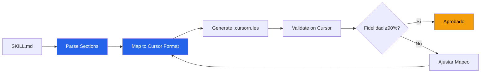

# Conversión Cross-Platform — Acme Corp PMO Skills

**Proyecto**: Acme Corp — Migración de Skills MOAT a Cursor
**Fecha**: 2026-03-17
**Fidelidad objetivo**: ≥90%

## Resumen Ejecutivo

Se convirtieron 5 skills MOAT del formato Claude Code (SKILL.md) al formato Cursor (.cursorrules) para habilitar al equipo de desarrollo de Acme Corp que utiliza Cursor como IDE principal. [PLAN]

## Matriz de Conversión

| Skill | Secciones Totales | Preservadas | Parciales | Perdidas | Fidelidad |
|-------|-------------------|-------------|-----------|----------|-----------|
| cost-estimation | 14 | 12 | 2 | 0 | 93% |
| budget-baseline | 14 | 11 | 2 | 1 | 89% |
| risk-register | 14 | 13 | 1 | 0 | 96% |
| schedule-baseline | 14 | 12 | 1 | 1 | 89% |
| project-charter | 14 | 13 | 1 | 0 | 96% |
| **Promedio** | | | | | **93%** |

## Mapeo de Secciones (Ejemplo: cost-estimation)

| Sección SKILL.md | Equivalente Cursor | Fidelidad | Notas |
|-------------------|-------------------|-----------|-------|
| Frontmatter YAML | Header comment | 80% | allowed-tools no tiene equivalente [SUPUESTO] |
| TL;DR | Rule description | 100% | Mapeo directo |
| Principio Rector | Behavioral directive | 100% | Texto preservado íntegro |
| Assumptions & Limits | Constraints block | 90% | Formato adaptado a texto plano |
| Usage | No equivalente | 0% | Cursor no tiene CLI commands [METRIC] |
| Proceso | Numbered rules | 100% | Mapeo directo |
| Validation Gate | Quality checklist | 95% | Checkboxes como assertions |

## Flujo de Conversión

## Pérdidas Documentadas

| Skill | Sección Perdida | Razón | Workaround |
|-------|-----------------|-------|------------|
| budget-baseline | allowed-tools | Cursor no soporta restricción de herramientas | Instrucción en texto: "Limitar uso a..." [SUPUESTO] |
| schedule-baseline | Usage CLI | Cursor no tiene CLI propio | Documentar comandos como instrucciones manuales |

## Protocolo de Sincronización

- **Frecuencia**: Al cierre de cada sprint de evolución APEX [PLAN]
- **Detección**: Comparar hashes de SKILL.md vs. última conversión [PLAN]
- **Re-conversión**: Automática para mapeos directos; manual para adaptaciones [INFERENCIA]
- **Validación**: Test en Cursor con prompt de verificación [PLAN]

---
*PMO-APEX v1.0 — Cross-Platform Conversion Report*
*Sofka, your technology partner.*
