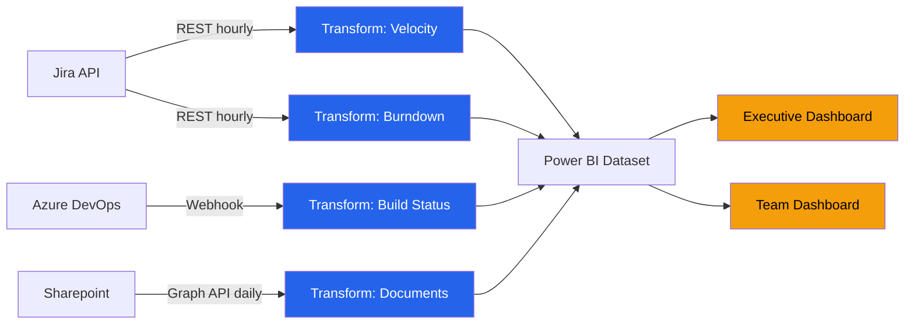

# Dashboard Tooling Configuration — Acme Corp ERP Migration

**Proyecto**: Acme Corp — ERP Migration Phase 2
**Fecha**: 2026-03-17
**Dashboard Platform**: Power BI + Jira native

## Arquitectura de Data Feeds

## Inventario de Feeds

| Feed ID | Fuente | Métrica | Método | Refresh | Estado |
|---------|--------|---------|--------|---------|--------|
| F-001 | Jira | Velocity (SP/sprint) | REST API v3 | Hourly | Activo [METRIC] |
| F-002 | Jira | Sprint burndown | REST API v3 | Hourly | Activo [METRIC] |
| F-003 | Jira | Defect density | REST API v3 | Daily | Activo [METRIC] |
| F-004 | Azure DevOps | Build success rate | Webhook | Real-time | Activo [METRIC] |
| F-005 | Sharepoint | Document completion | Graph API | Daily | Activo [PLAN] |
| F-006 | Manual | Budget actuals | CSV upload | Weekly | Parcial [SUPUESTO] |

## Reglas de Alerta

| Alerta | Métrica | Umbral | Tier | Canal |
|--------|---------|--------|------|-------|
| ALT-001 | Velocity | Drop >20% vs. promedio 3 sprints | Tier-2 Warning | Email PM + Slack |
| ALT-002 | Sprint completion | <80% planned SP | Tier-2 Warning | Email PM |
| ALT-003 | CPI | <0.90 | Tier-3 Critical | Email Sponsor + PM + Slack |
| ALT-004 | Build failures | >3 consecutivos | Tier-1 Info | Dashboard badge |
| ALT-005 | Feed staleness | >4h sin refresh | Tier-2 Warning | Email Dashboard Owner |

## Access Control

| Rol | Dashboards | Permisos | Justificación |
|-----|-----------|----------|---------------|
| Sponsor | Executive | View only | Visibilidad estratégica [STAKEHOLDER] |
| PM | Executive + Team | View + Export | Gestión operativa [PLAN] |
| Tech Lead | Team + DevOps | View + Drill-down | Coordinación técnica |
| Team Member | Team | View | Transparencia de sprint |

## Plan de Mantenimiento

| Actividad | Frecuencia | Responsable | Criterio de Éxito |
|-----------|-----------|-------------|-------------------|
| Feed health check | Semanal | Dashboard Owner | 100% feeds activos |
| Widget validation | Mensual | PM | Datos correctos vs. fuente |
| Alert calibration | Trimestral | PM + Tech Lead | <2 false alerts/semana |
| Dashboard redesign | Semestral | PMO | Stakeholder satisfaction >80% |

---
*PMO-APEX v1.0 — Dashboard Tooling Configuration*
*Sofka, your technology partner.*
