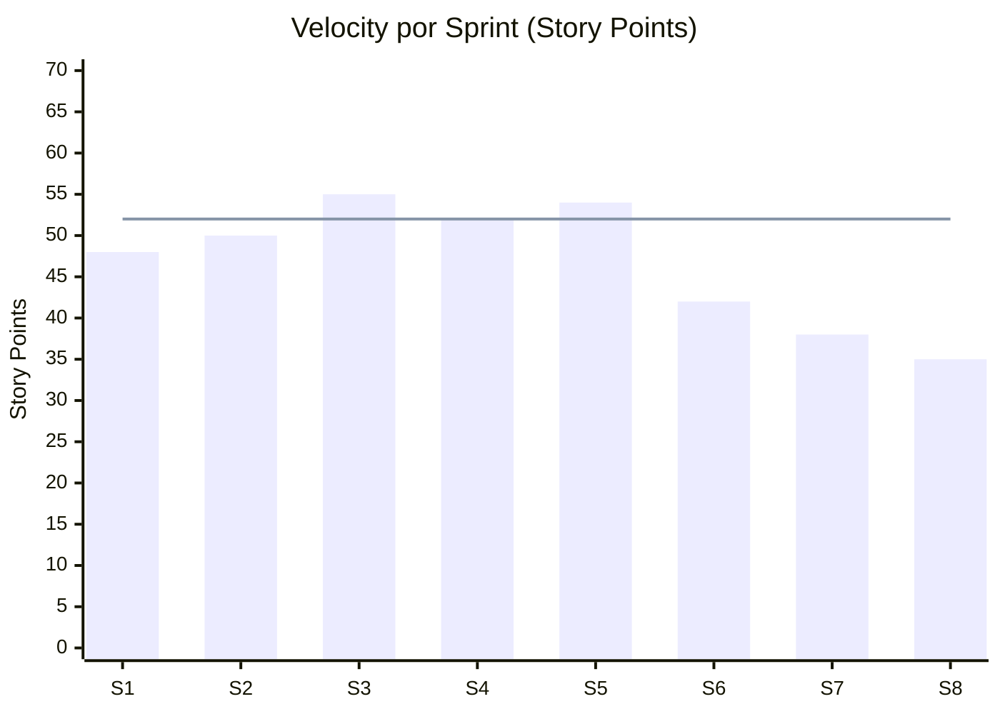

# Data Story: Schedule Risk — Acme Corp ERP Migration

**Proyecto**: Acme Corp — ERP Migration Phase 2
**Audiencia**: Sponsor (VP Operations)
**Fecha**: 2026-03-17

## Context

El proyecto de migración ERP lleva 8 de 14 sprints planificados (57% del timeline). El equipo de 12 personas ha entregado 340 de 580 story points del backlog total. [METRIC]

## Insight

La velocidad del equipo ha caído de 52 SP/sprint (promedio sprints 1-5) a 38 SP/sprint (promedio sprints 6-8) — una reducción del 27%. [METRIC]

> **Callout**: La línea horizontal marca el velocity promedio planificado (52 SP). Los últimos 3 sprints están consistentemente por debajo. [METRIC]

## Implication

| Escenario | Velocity Proyectada | Sprints Restantes | Fecha Estimada | Desviación |
|-----------|--------------------|--------------------|----------------|------------|
| Optimista | 45 SP/sprint | 6 sprints | 2026-07-15 | +1 sprint [INFERENCIA] |
| Probable | 38 SP/sprint | 7 sprints | 2026-08-12 | +2 sprints [METRIC] |
| Pesimista | 32 SP/sprint | 8 sprints | 2026-09-09 | +3 sprints [SUPUESTO] |

Al ritmo actual (38 SP/sprint), quedan 240 SP por completar, lo que requiere ~7 sprints adicionales en lugar de los 6 planificados. **La fecha de entrega se desplaza de julio a agosto 2026.** [METRIC]

## Causas Identificadas

| Causa | Contribución | Evidencia |
|-------|-------------|-----------|
| Deuda técnica en módulo financiero | 40% | 3 sprints de refactoring no planificado [METRIC] |
| Rotación de 2 desarrolladores | 35% | Onboarding redujo capacidad efectiva [STAKEHOLDER] |
| Complejidad de integración subestimada | 25% | Estimaciones originales off by 40% [HISTORICO] |

## Action — Opciones de Decisión

| Opción | Impacto en Schedule | Impacto en Scope | Costo Adicional |
|--------|--------------------|--------------------|-----------------|
| A: Agregar 2 desarrolladores | Recuperar 1 sprint | Sin reducción | +2 FTE-meses [SUPUESTO] |
| B: Reducir scope Phase 2 | Mantener fecha original | -60 SP (reportes avanzados) | Ninguno [PLAN] |
| C: Extender timeline 2 sprints | +4 semanas | Sin reducción | +12% presupuesto [METRIC] |

**Recomendación**: Opción B + C parcial — reducir scope en 30 SP (reportes no-críticos) y extender 1 sprint. Minimiza costo adicional y preserva funcionalidad core. [INFERENCIA]

---
*PMO-APEX v1.0 — Data Story: Schedule Risk Analysis*
*Sofka, your technology partner.*
