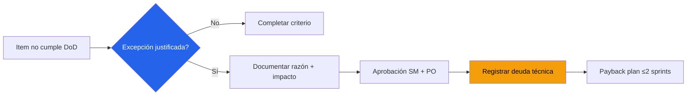

# Definition of Done & Definition of Ready — Acme Corp ERP Migration

**Proyecto**: Acme Corp — ERP Migration Phase 2
**Metodología**: Scrum (sprints de 2 semanas)
**Equipo**: 12 personas (4 senior, 6 mid, 2 junior)
**Fecha**: 2026-03-17

## Story-Level DoD

| # | Criterio | Verificación | Nivel |
|---|----------|-------------|-------|
| 1 | Código escrito siguiendo estándares del equipo | Code review aprobado por ≥1 peer | L2 Auto [PLAN] |
| 2 | Unit tests escritos con coverage ≥80% | SonarQube report | L2 Auto [METRIC] |
| 3 | Integration tests pass | CI pipeline green | L2 Auto [METRIC] |
| 4 | Desplegado en staging | Deployment pipeline complete | L2 Auto [PLAN] |
| 5 | Acceptance criteria verificados | PO sign-off en Jira | L1 Manual [STAKEHOLDER] |
| 6 | No vulnerabilidades críticas | OWASP ZAP scan | L2 Auto [PLAN] |
| 7 | Documentación API actualizada | Swagger auto-generated | L2 Auto [PLAN] |

**Compliance Target**: 100% de criterios cumplidos = Done. Excepción requiere aprobación de Scrum Master + PO.

## Feature-Level DoD

| # | Criterio | Verificación | Nivel |
|---|----------|-------------|-------|
| 1 | Todos los stories del feature cumplen Story DoD | Jira filter check | L2 Auto |
| 2 | E2E tests pass para el feature completo | Cypress test suite | L2 Auto [METRIC] |
| 3 | Performance dentro de SLA (response <2s) | Load test report | L2 Auto [METRIC] |
| 4 | User documentation actualizada | Wiki page reviewed | L1 Manual [PLAN] |
| 5 | Data migration scripts validados | Migration test pass | L2 Auto [PLAN] |

## Release-Level DoD

| # | Criterio | Verificación | Nivel |
|---|----------|-------------|-------|
| 1 | Todos los features cumplen Feature DoD | Jira release filter | L2 Auto |
| 2 | Regression test suite pass (100%) | Full regression run | L2 Auto [METRIC] |
| 3 | Release notes completas | Document review | L1 Manual [PLAN] |
| 4 | Rollback plan documentado y testado | Dry run execution | L1 Manual [PLAN] |
| 5 | Stakeholder sign-off obtenido | Sign-off document | L1 Manual [STAKEHOLDER] |
| 6 | Training materials entregados | Completion checklist | L1 Manual [STAKEHOLDER] |

## Definition of Ready (DoR)

| # | Criterio | Responsable |
|---|----------|-------------|
| 1 | User story en formato "Como...quiero...para..." | Product Owner |
| 2 | ≥3 acceptance criteria SMART y testables | Product Owner + QA |
| 3 | Story points estimados por equipo | Team (planning poker) |
| 4 | Dependencias identificadas y resueltas/planificadas | Scrum Master |
| 5 | Mockup aprobado (si tiene UI) | UX Designer |
| 6 | Datos de prueba disponibles | QA Engineer |

## Proceso de Excepción

## Plan de Evolución

| Trimestre | Acción | Target |
|-----------|--------|--------|
| Q2 2026 | Automatizar criterios L1 restantes | Maturity Score 75% [PLAN] |
| Q3 2026 | Agregar criterios de accesibilidad | WCAG AA coverage [PLAN] |
| Q4 2026 | Implementar DoD predictivo (pre-commit hooks) | Maturity Score 85% [SUPUESTO] |

---
*PMO-APEX v1.0 — Definition of Done Standards*
*Sofka, your technology partner.*
