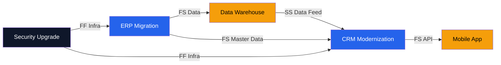

# Dependency Mapping — Acme Corp Digital Portfolio

**Portfolio**: Acme Corp — Digital Transformation 2026
**Proyectos activos**: 5
**Fecha**: 2026-03-17

## Dependency Network Diagram



## Dependency Matrix

| | ERP | CRM | DW | Mobile | Security |
|---|:---:|:---:|:---:|:---:|:---:|
| **ERP** | - | FS-H | FS-M | - | FF-M |
| **CRM** | - | - | SS-M | FS-H | FF-M |
| **DW** | - | - | - | - | - |
| **Mobile** | - | - | - | - | - |
| **Security** | - | - | - | - | - |

*Lectura: fila "depende de" columna. H=High, M=Medium risk.* [PLAN]

## Inventario de Dependencias

| ID | Provider | Consumer | Tipo | Naturaleza | Riesgo | Estado |
|----|----------|----------|------|-----------|--------|--------|
| D-001 | ERP | Data Warehouse | FS | Data | Medio | On track [METRIC] |
| D-002 | CRM | Mobile App | FS | API | Alto | At risk [METRIC] |
| D-003 | Data Warehouse | CRM | SS | Data Feed | Medio | On track [PLAN] |
| D-004 | Security | ERP | FF | Infrastructure | Medio | On track [PLAN] |
| D-005 | Security | CRM | FF | Infrastructure | Medio | On track [PLAN] |
| D-006 | ERP | CRM | FS | Master Data | Alto | Blocked [SCHEDULE] |

## Circular Dependency Analysis

**Ciclos detectados**: 0

Análisis: No se detectaron dependencias circulares. El grafo es un DAG (Directed Acyclic Graph) válido. [METRIC]

## Critical Dependency Chain

```
Security Upgrade → ERP Migration → CRM Modernization → Mobile App
```

**Impacto**: Cualquier retraso en Security propaga a 3 proyectos downstream. Retraso de 1 semana en Security = ~1.5 semanas en Mobile App (acumulado con buffers). [SCHEDULE]

## Risk Assessment

| Dependencia | Probabilidad | Impacto | Score | Mitigación |
|-------------|-------------|---------|-------|------------|
| D-006 (ERP→CRM) | 70% | Alto | 0.7 | Intermediate data export semanal [PLAN] |
| D-002 (CRM→Mobile) | 50% | Alto | 0.5 | API mock para desarrollo paralelo [PLAN] |
| D-001 (ERP→DW) | 30% | Medio | 0.3 | Buffer de 1 sprint [SCHEDULE] |

**Portfolio Dependency Risk Index**: 0.38 (target <0.4) -- dentro del umbral pero en el límite. [METRIC]

## Monitoring Protocol

| Actividad | Frecuencia | Responsable |
|-----------|-----------|-------------|
| Dependency status update | Semanal | Cada PM proveedor |
| Cross-project sync | Bi-semanal | Portfolio Manager |
| Dependency risk review | Mensual | Steering Committee |
| Full dependency refresh | Trimestral | PMO |

---
*PMO-APEX v1.0 — Dependency Mapping Report*
*Sofka, your technology partner.*
