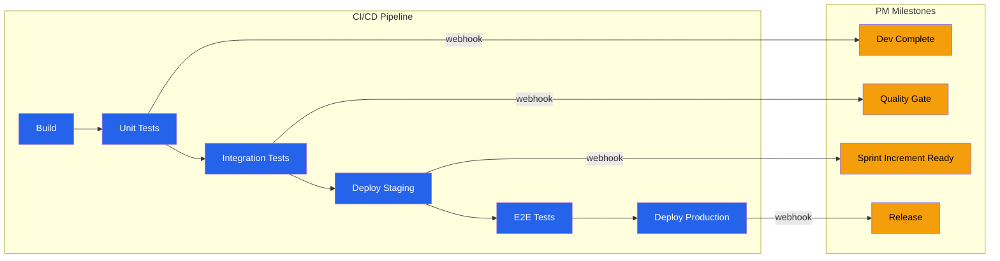

# DevOps-PM Operating Model — Acme Corp ERP Migration

**Proyecto**: Acme Corp — ERP Migration Phase 2
**CI/CD**: GitHub Actions + ArgoCD
**PM Tool**: Jira + Confluence
**Fecha**: 2026-03-17

## Pipeline-to-Milestone Map

## DORA-PM Correlation

| DORA Metric | Valor Actual | PM KPI | Valor Actual | Correlación |
|-------------|-------------|--------|-------------|-------------|
| Deployment Frequency | 3/week | Sprint Completion Rate | 85% | Positiva [METRIC] |
| Lead Time | 2.5 days | Cycle Time | 4.2 days | Directa [METRIC] |
| MTTR | 45 min | Schedule Impact per Incident | 0.5 SP/incident | Inversa [METRIC] |
| Change Failure Rate | 8% | Defect Density | 0.12/SP | Proporcional [METRIC] |

## Change Control Tiers

| Tier | Tipo de Cambio | Aprobación | SLA | Documentación |
|------|---------------|-----------|-----|---------------|
| 0 | Bug fix, patch | Pipeline gates | Minutes | Auto (commit msg) |
| 1 | Planned feature | Team + PO at sprint review | Sprint boundary | Jira ticket [PLAN] |
| 2 | Infrastructure | CCB review | 48h | RFC document [PLAN] |
| 3 | DB migration | CCB + DBA | 1 week | RFC + runbook [PLAN] |
| E | Emergency P1 | Tech Lead + PM | Immediate | Post-hoc CCB review [STAKEHOLDER] |

## Integrated Ceremony Calendar

| Día | Ceremonia | DevOps Agenda | PM Agenda | Duración |
|-----|-----------|--------------|-----------|----------|
| Lunes | Sprint Planning | Pipeline capacity, tech debt budget | Sprint goal, backlog | 2h |
| Diario | Standup | Deploy status, incidents | Sprint progress, blockers | 15min |
| Miércoles | Midweek Sync | Release readiness | Milestone progress | 30min |
| Viernes S2 | Sprint Review | Deploy demo, DORA metrics | Velocity, acceptance | 1.5h |
| Viernes S2 | Retrospective | Pipeline improvements | Process improvements | 1h |

## Escalation Protocol

| Incident Severity | Tiempo Máximo sin Escalar | Escalación PM | Notificación |
|-------------------|--------------------------|---------------|-------------|
| P1 (outage) | Inmediato | Risk register + sponsor | Slack + email [STAKEHOLDER] |
| P2 (degraded >4h) | 4 horas | Risk register | Slack PM channel [PLAN] |
| P3 (recurrente >3/sprint) | Fin de sprint | Risk register | Retrospective agenda [PLAN] |
| P4 (cosmetic) | No escala | N/A | N/A |

## Alignment Maturity Score

| Dimensión | Score | Evidencia |
|-----------|-------|-----------|
| Data Integration | 20/25 | Webhooks configurados, 1 feed manual restante [METRIC] |
| Process Integration | 18/25 | Release aligned con sprint, 1 ceremony duplicada [METRIC] |
| Ceremony Integration | 15/25 | Standup integrado, retro separada [METRIC] |
| Governance Integration | 20/25 | Tiers implementados, emergency tier en prueba [METRIC] |
| **Total** | **73/100** | **Nivel: Integrated** |

---
*PMO-APEX v1.0 — DevOps-PM Alignment Operating Model*
*Sofka, your technology partner.*
