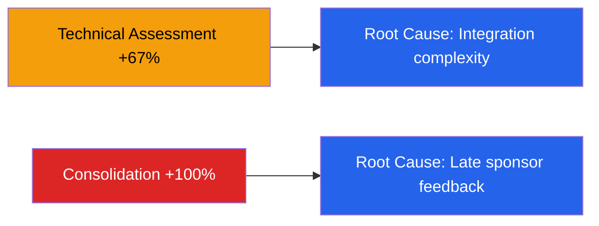

# Discovery Retrospective — Acme Corp ERP Migration

**Proyecto**: Acme Corp — ERP Migration Phase 2
**Discovery Duration**: 4 semanas (planificado: 3 semanas)
**Fecha de Retrospectiva**: 2026-03-17

## Discovery Quality Scorecard

| Deliverable | Completeness | Accuracy | Actionability | Evidence | Total | Rating |
|-------------|:---:|:---:|:---:|:---:|:---:|:---:|
| Project Charter | 28/30 | 22/25 | 24/25 | 18/20 | **92** | Excellent [METRIC] |
| Stakeholder Register | 30/30 | 20/25 | 20/25 | 16/20 | **86** | Excellent [METRIC] |
| Risk Register | 25/30 | 23/25 | 22/25 | 18/20 | **88** | Excellent [METRIC] |
| Cost Estimation | 22/30 | 18/25 | 20/25 | 14/20 | **74** | Good [METRIC] |
| Schedule Baseline | 20/30 | 15/25 | 18/25 | 12/20 | **65** | Acceptable [METRIC] |
| Methodology Assessment | 26/30 | 20/25 | 22/25 | 16/20 | **84** | Good [METRIC] |
| **Overall Score** | | | | | **81.5** | **Good** |

## Timeline Analysis

| Fase | Planificado | Real | Variance | Causa |
|------|-----------|------|----------|-------|
| Inception | 3 días | 3 días | 0% | On target [SCHEDULE] |
| Stakeholder Analysis | 2 días | 2 días | 0% | On target [SCHEDULE] |
| Technical Assessment | 3 días | 5 días | +67% | Complejidad de integración subestimada [METRIC] |
| Cost & Schedule | 3 días | 4 días | +33% | Datos financieros tardaron en llegar [STAKEHOLDER] |
| Methodology Design | 2 días | 2 días | 0% | On target [SCHEDULE] |
| Consolidation | 2 días | 4 días | +100% | Rework por feedback de sponsor [PLAN] |
| **Total** | **15 días** | **20 días** | **+33%** | |

## Assumption Validation Tracker

| ID | Supuesto | Estado | Evidencia |
|----|----------|--------|-----------|
| S-001 | ERP vendor soporte L2 disponible | Validated | Contrato firmado [PLAN] |
| S-002 | Team velocity ~50 SP/sprint | Invalidated | Real: 38 SP/sprint [METRIC] |
| S-003 | Data migration <2 semanas | Pending | Aún no ejecutado [SUPUESTO] |
| S-004 | Budget approval Q1 | Validated | Aprobado 2026-02-15 [STAKEHOLDER] |
| S-005 | 3 integrations requeridas | Invalidated | Descubiertas 5 integraciones [METRIC] |

**Validation Rate**: 2/5 (40%) validated, 2/5 (40%) invalidated, 1/5 (20%) pending [METRIC]

## Pipeline Friction Points

**Pipeline Efficiency Score**: 72% (target: ≥80%) [METRIC]

## Improvement Actions

| # | Acción | Owner | Deadline | Impacto Esperado |
|---|--------|-------|----------|-----------------|
| 1 | Incluir assessment técnico de integraciones como fase separada | Tech Lead | Próximo discovery | -50% variance en Technical Assessment [PLAN] |
| 2 | Programar checkpoint de sponsor al día 5 (no al final) | PM | Inmediato | -50% rework en Consolidation [STAKEHOLDER] |
| 3 | Mejorar template de cost estimation con más data points | Cost Analyst | 2 semanas | Quality score ≥80 en Cost Estimation [PLAN] |

## Calibration Updates

| Parámetro | Valor Anterior | Valor Nuevo | Justificación |
|-----------|---------------|-------------|---------------|
| Technical Assessment duration | 3 días | 4 días | Historical variance 67% [HISTORICO] |
| Consolidation buffer | 0 días | 1 día | Rework rate 100% [METRIC] |
| Sponsor checkpoint | Final only | Day 5 + Final | Reduce late-stage rework [PLAN] |

---
*PMO-APEX v1.0 — Discovery Retrospective Report*
*Sofka, your technology partner.*
