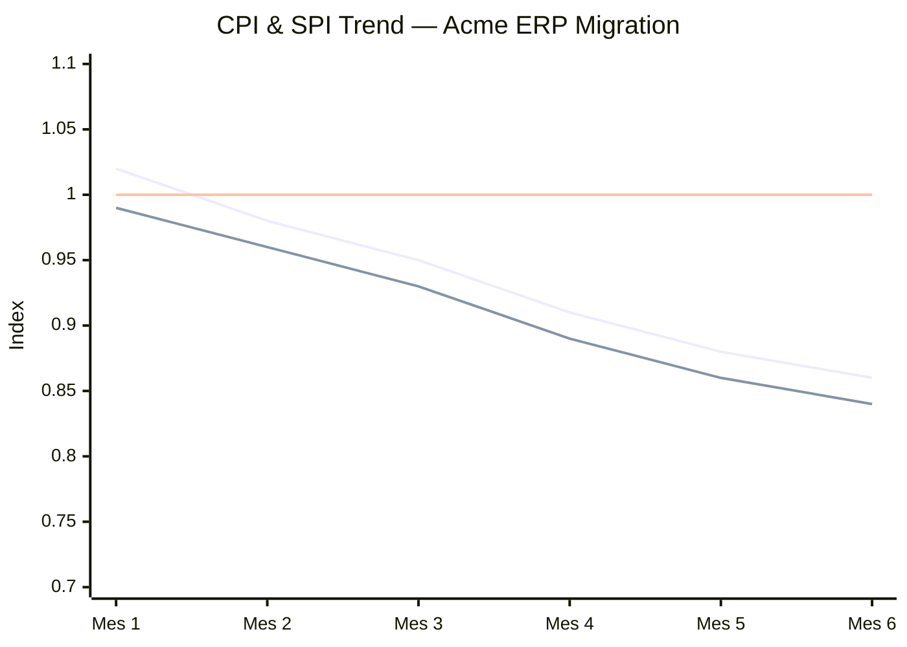

# 04 EVM Analysis — Acme Corp ERP Migration

> **Proyecto:** Acme Corp ERP Migration | **Periodo:** Marzo 2026 (Mes 6 de 12)
> **BAC:** 960 FTE-horas | **% Avance:** 42% | **Modo:** piloto-auto

---

## EVM Metrics Summary

| Metric | Value | Status | Evidence |
|--------|-------|--------|----------|
| PV | 480 FTE-h | — | `[PLAN]` baseline aprobada |
| EV | 403 FTE-h | — | `[METRIC]` entregables aceptados |
| AC | 470 FTE-h | — | `[METRIC]` sistema contable |
| CV | -67 FTE-h | Over budget | `[METRIC]` |
| SV | -77 FTE-h | Behind schedule | `[METRIC]` |
| CPI | 0.86 | 🔴 Red | `[METRIC]` |
| SPI | 0.84 | 🔴 Red | `[METRIC]` |
| EAC₁ | 1,116 FTE-h | BAC/CPI | `[METRIC]` |
| EAC₃ | 1,241 FTE-h | CPI×SPI | `[METRIC]` |
| ETC | 771 FTE-h | Remaining (EAC₃) | `[METRIC]` |
| VAC | -281 FTE-h | 29% overrun | `[METRIC]` |
| TCPI(BAC) | 1.14 | 🟠 Difficult | `[INFERENCIA]` |

**EAC Formula Selection:** EAC₃ (CPI×SPI) selected because schedule pressure is causing overtime costs — schedule and cost performance are correlated. `[PLAN]`

---

## CPI/SPI Trend

**Trend interpretation:** Both CPI and SPI show consistent monthly decline. CPI crossed the 0.90 threshold in Month 4 and has not recovered. Per CPI stability rule, at 42% completion this trend is unlikely to reverse by more than 10%. `[METRIC]`

---

## Management Actions

| # | Metric | Action | Responsible | Deadline |
|---|--------|--------|-------------|----------|
| 1 | CPI 0.86 🔴 | Conduct scope review — identify 15% of remaining scope for deferral or elimination | Scope Analyst + Sponsor | Week 25 |
| 2 | SPI 0.84 🔴 | Evaluate fast-tracking Phase 4 (parallel data migration + integration testing) | Schedule Planner | Week 24 |
| 3 | TCPI 1.14 🟠 | Present re-baseline proposal to steering committee with revised EAC₃ | Project Conductor | Gate G1.5 |

---

*PMO-APEX v1.0 — EVM Analysis · Acme Corp ERP Migration*
