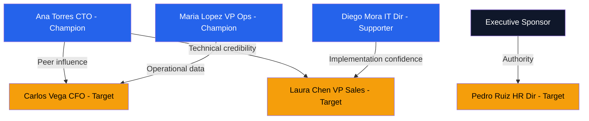

# Engagement Strategy — Acme Corp ERP Migration

**Proyecto**: Acme Corp — ERP Migration Phase 2
**Stakeholders clave**: 6
**Fecha**: 2026-03-17

## Engagement Gap Analysis

| Stakeholder | Rol | Power | Interest | Current | Desired | Gap | Priority |
|-------------|-----|:-----:|:--------:|:-------:|:-------:|:---:|:--------:|
| Maria Lopez | VP Operations | High | High | Supportive | Leading | 1 | High [STAKEHOLDER] |
| Carlos Vega | CFO | High | Medium | Neutral | Supportive | 1 | Critical [STAKEHOLDER] |
| Ana Torres | CTO | High | High | Leading | Leading | 0 | Maintain [STAKEHOLDER] |
| Pedro Ruiz | HR Director | Medium | Low | Unaware | Neutral | 2 | Medium [STAKEHOLDER] |
| Laura Chen | VP Sales | High | Medium | Resistant | Supportive | 2 | Critical [STAKEHOLDER] |
| Diego Mora | IT Director | Medium | High | Supportive | Leading | 1 | High [STAKEHOLDER] |

**Engagement Score**: 62% (target: ≥75%) [METRIC]

## Motivation Mapping

| Stakeholder | Motivación Primaria | Preocupación | WIIFM |
|-------------|-------------------|-------------|-------|
| Carlos Vega (CFO) | Control financiero, ROI | Costo del proyecto vs. beneficios | "ERP reduce costos operativos 18% en Y2" [INFERENCIA] |
| Laura Chen (VP Sales) | Revenue growth, team efficiency | Disrupción durante migración | "Nuevo CRM integration acelera pipeline 25%" [INFERENCIA] |
| Pedro Ruiz (HR Dir) | Employee satisfaction | Change fatigue en equipos | "Self-service HR modules reduce admin 40%" [INFERENCIA] |

## Influence Approach per Stakeholder

| Stakeholder | Táctica | Actividades | Timeline |
|-------------|---------|-------------|----------|
| Carlos Vega | Data-driven + Authority | 1-on-1 con business case financiero, sponsor endorsement | Mes 1-2 [PLAN] |
| Laura Chen | Demonstration + Coalition | Demo de CRM integration, testimonial de Ana Torres | Mes 1-3 [PLAN] |
| Pedro Ruiz | Participation | Incluir en steering committee, workshops de change impact | Mes 2-4 [PLAN] |
| Maria Lopez | Vision + Recognition | Posicionar como champion visible, executive sponsor role | Continuo [PLAN] |

## Coalition Map

## Resistance Analysis — Laura Chen

| ADKAR Element | Assessment | Intervención |
|---------------|-----------|-------------|
| Awareness | Present | Sabe del proyecto y su impacto |
| **Desire** | **Missing** | No ve beneficio personal; teme disrupción en ventas |
| Knowledge | N/A | Pendiente hasta Desire resuelto |
| Ability | N/A | Pendiente |
| Reinforcement | N/A | Pendiente |

**Root Cause**: Fear of revenue disruption during migration period. Previous ERP project caused 3 weeks of sales system downtime. [HISTORICO]

**Intervención**: Demo de migration approach con zero-downtime cutover. Testimonial de referencia similar. Data de pilot showing no revenue impact. [PLAN]

## Tracking Metrics

| Métrica | Valor Actual | Target | Medición |
|---------|-------------|--------|----------|
| Engagement Score | 62% | ≥75% | Mensual [METRIC] |
| Gap Closure Rate | N/A (baseline) | ≥30%/quarter | Trimestral [METRIC] |
| Champion Ratio | 33% (2/6) | ≥33% | Trimestral [METRIC] |

---
*PMO-APEX v1.0 — Stakeholder Engagement Strategy*
*Sofka, your technology partner.*
