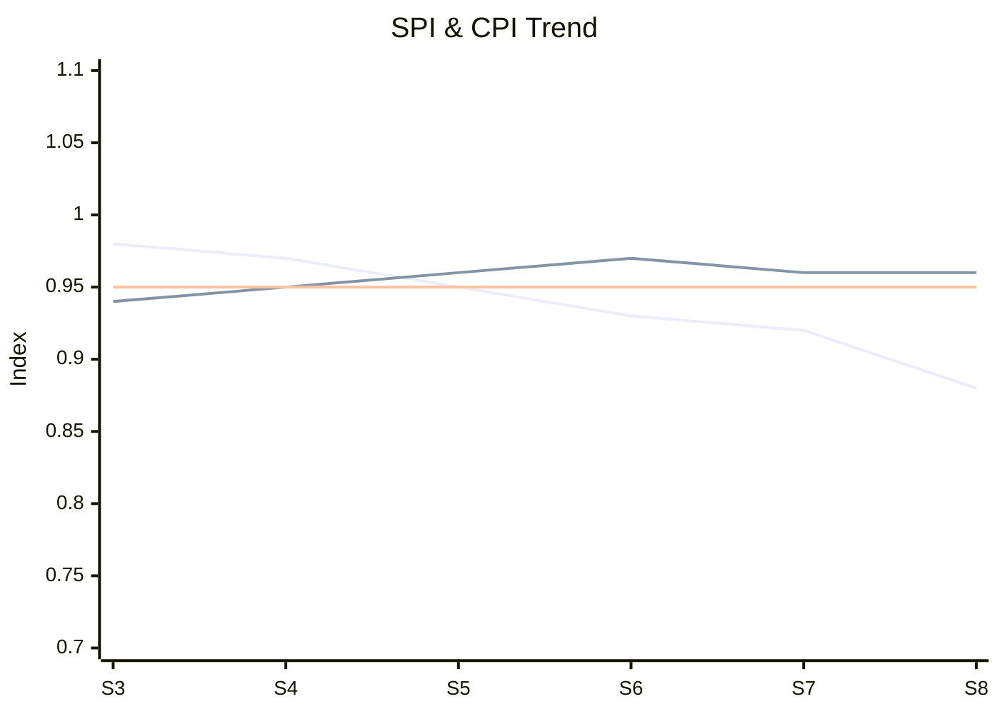

# Executive Dashboard — Acme Corp ERP Migration

**Proyecto**: Acme Corp — ERP Migration Phase 2
**Periodo**: Sprint 8 / Marzo 2026
**Data as of**: 2026-03-17

---

## Overall Status: AMBER

> Schedule at risk due to velocity decline. Cost and quality on track. 1 decision pending sponsor approval.

## KPI Dashboard

| KPI | Value | Target | RAG | Trend | Commentary |
|-----|-------|--------|:---:|:-----:|-----------|
| SPI | 0.88 | ≥0.95 | Amber | Declining | Down from 0.92 last sprint [METRIC] |
| CPI | 0.96 | ≥0.95 | Blue | Stable | Within target range [METRIC] |
| Velocity | 38 SP | 52 SP | Amber | Declining | 27% below plan, 3rd sprint declining [METRIC] |
| Sprint Completion | 82% | ≥90% | Amber | Stable | Consistent at 80-85% range [METRIC] |
| Defect Density | 0.08/SP | ≤0.10 | Blue | Improving | Down from 0.12 two sprints ago [METRIC] |
| Budget Burn | 62% | 57% (planned) | Blue | Slightly ahead | 5% ahead of plan but within tolerance [METRIC] |

## Trend Analysis (Last 6 Sprints)

## Top 3 Risks

| # | Risk | Impact | Prob | RAG | Response |
|---|------|--------|------|:---:|----------|
| R-1 | Velocity decline continues | +3 sprints | 70% | Red | Resource optimization plan in progress [PLAN] |
| R-2 | Financial module integration | +2 weeks CP | 60% | Amber | Technical spike this sprint [PLAN] |
| R-3 | Key developer attrition | Knowledge loss | 40% | Amber | Retention + knowledge transfer [STAKEHOLDER] |

## Decision Queue

| Decision | Deadline | Impact of Delay | Options | Recommendation |
|----------|----------|-----------------|---------|---------------|
| Scope adjustment for on-time delivery | Mar 24 | Schedule risk increases weekly | A: Reduce scope, B: Add resources, C: Extend | Option A [PLAN] |

## Value Tracker

| Benefit | Target | Realized | Status |
|---------|--------|----------|--------|
| Process automation | 40% effort reduction | 15% (Phase 1 modules) | On track for Phase 2 [PLAN] |
| Data consolidation | Single source of truth | 3 of 5 data domains migrated | On track [METRIC] |
| OpEx reduction | 18% by Year 2 | Projected 16-20% | Within range [SUPUESTO] |

## Drill-Down Links

| Section | Detailed Report |
|---------|----------------|
| Schedule Analysis | `reports/schedule_analysis_sprint8.md` |
| Risk Register | `reports/risk_register_current.md` |
| Financial Status | `reports/financial_status_march.md` |

---
*PMO-APEX v1.0 — Executive Dashboard*
*Data refreshed: 2026-03-17 | Next refresh: Sprint 9*
*Sofka, your technology partner.*
