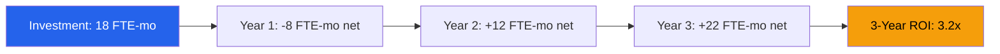

# Funding Request — Acme Corp Digital Transformation Platform

**Project**: Customer Experience Modernization Platform
**Sponsor**: VP Digital Innovation, Acme Corp
**Date**: 2026-Q1
**Status**: {WIP}

## Executive Summary

Acme Corp requests 18 FTE-months of investment to deliver a unified Customer Experience Platform, replacing 4 legacy systems and enabling omnichannel engagement. Expected ROI: 3.2x over 24 months. [PLAN]

## Investment Overview

| Category | FTE-Months | Percentage |
|----------|-----------|------------|
| Engineering | 10 | 55.6% |
| UX/Design | 3 | 16.7% |
| QA & DevOps | 2.5 | 13.9% |
| PM & Governance | 1.5 | 8.3% |
| Contingency | 1 | 5.6% |
| **Total** | **18** | **100%** |

## Financial Analysis

| Metric | Value | Evidence |
|--------|-------|----------|
| NPV (3-year, 10% discount) | 26 FTE-months equivalent | [METRIC] |
| IRR | 42% | [METRIC] |
| Payback Period | 14 months | [METRIC] |
| BCR | 3.2:1 | [METRIC] |

## Phased Disbursement

| Phase | Duration | FTE-Months | Gate |
|-------|----------|-----------|------|
| Discovery & Design | 6 weeks | 3 | G1: Architecture approved |
| MVP Development | 10 weeks | 8 | G2: MVP deployed to staging |
| Rollout & Optimization | 8 weeks | 6 | G3: Production launch |
| Contingency | — | 1 | Released on trigger |

## Risk-Adjusted Scenarios

| Scenario | Probability | Budget | ROI |
|----------|------------|--------|-----|
| Optimistic | 20% | 15 FTE-mo | 4.1x |
| Baseline | 60% | 18 FTE-mo | 3.2x |
| Pessimistic | 20% | 23 FTE-mo | 2.1x |

## Alternatives Considered

1. **Extend Legacy Systems** — Lower upfront cost but 2x maintenance burden by Year 2 [INFERENCIA]
2. **COTS Platform** — Faster deployment but limited customization; vendor lock-in risk [SUPUESTO]
3. **Phased Custom Build** — Selected approach; balances speed, control, and cost [PLAN]

## Approval Request

We request steering committee approval for 18 FTE-months with stage-gate disbursement. First gate review at Week 6. [STAKEHOLDER]

*PMO-APEX v1.0 — Examples · Funding Request*
