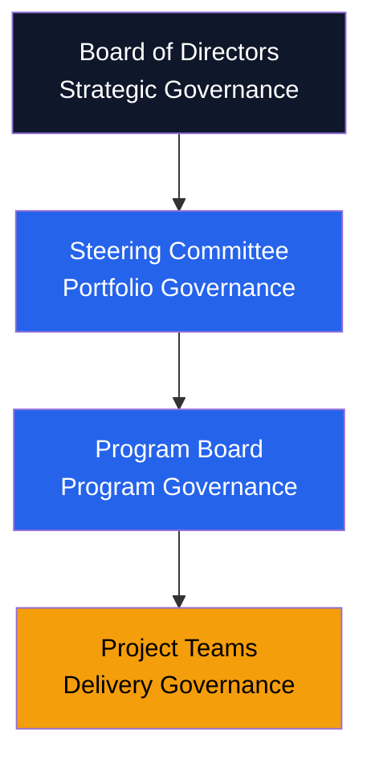

# Governance Framework — Acme Corp Enterprise Transformation Program

**Program**: Digital Transformation 2026
**PMO Director**: J. Martinez
**Date**: 2026-Q1
**Status**: {WIP}

## Governance Tiers

## Decision Rights Matrix

| Decision | Board | Steering | Program Board | PM |
|----------|-------|----------|---------------|-----|
| Strategic direction | A | R | I | I |
| Budget > 100 FTE-mo | A | R | C | I |
| Budget 10-100 FTE-mo | I | A | R | C |
| Budget < 10 FTE-mo | I | I | A | R |
| Scope changes (critical) | I | A | R | R |
| Resource allocation | I | I | A | R |
| Risk escalation (high) | I | A | R | R |
| Vendor selection | I | A | R | C |

## Escalation Thresholds

| Zone | Schedule | Cost | Quality | Authority |
|------|----------|------|---------|-----------|
| Green | < 5% variance | < 5% variance | All gates pass | PM manages |
| Amber | 5-15% variance | 5-10% variance | Minor gate issues | Program Board |
| Red | > 15% variance | > 10% variance | Gate failure | Steering Committee |

## Meeting Cadence

| Forum | Frequency | Duration | Chair | Quorum |
|-------|-----------|----------|-------|--------|
| Board Review | Quarterly | 2 hours | CEO | 60% |
| Steering Committee | Monthly | 90 min | CTO | 75% |
| Program Board | Bi-weekly | 60 min | Program Director | 100% |
| Project Standup | Daily | 15 min | PM | Team leads |
| Change Control Board | As needed | 45 min | PMO Director | 60% |

## Governance Artifacts

| Artifact | Owner | Template | Review Cycle |
|----------|-------|----------|-------------|
| Governance Charter | PMO Director | GOV-001 | Annual |
| Decision Log | PM | GOV-002 | Continuous |
| Escalation Register | PM | GOV-003 | As needed |
| Stage Gate Checklist | QA Lead | GOV-004 | Per gate |
| Compliance Matrix | Legal | GOV-005 | Quarterly |

## Compliance Requirements

- SOC 2 Type II audit trail for all decisions [METRIC]
- GDPR data governance integration [DOC]
- Internal audit access to all governance artifacts [STAKEHOLDER]

*PMO-APEX v1.0 — Examples · Governance Framework*
