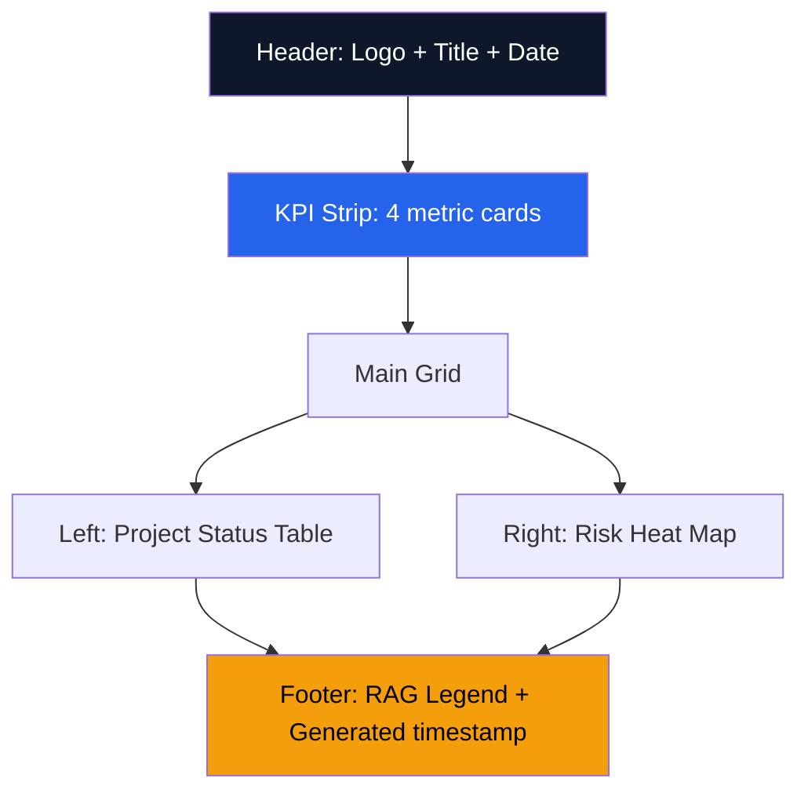

# HTML Brand Output — Acme Corp Executive Dashboard

**Artifact**: Portfolio Health Dashboard
**Brand**: APEX Design System
**Date**: 2026-Q1
**Status**: {WIP}

## Design Token Specification

```css
:root {
  --apex-primary: #2563EB;
  --apex-accent: #F59E0B;
  --apex-dark: #0F172A;
  --apex-bg: #F8FAFC;
  --apex-text: #1E293B;
  --apex-success: #10B981;
  --apex-warning: #F59E0B;
  --apex-danger: #EF4444;
  --apex-font: 'Inter', system-ui, sans-serif;
  --apex-radius: 8px;
  --apex-shadow: 0 1px 3px rgba(0,0,0,0.12);
}
```

## Dashboard Layout



## Component Inventory

| Component | Token Usage | Accessibility |
|-----------|------------|---------------|
| KPI Card | `--apex-primary` bg, `--apex-bg` text | aria-label with metric name |
| RAG Indicator | success/warning/danger tokens | Icon + text label (not color-only) |
| Data Table | `--apex-dark` headers | scope attributes, caption |
| Sparkline | `--apex-primary` stroke | aria-describedby to data table |
| Navigation | `--apex-accent` active state | Keyboard focusable |

## Sample KPI Strip

| Metric | Value | Trend | RAG |
|--------|-------|-------|-----|
| Active Projects | 12 | +2 vs last month | Green [METRIC] |
| On-Track % | 83% | -5% vs last month | Amber [METRIC] |
| Budget Utilization | 72% | +3% vs last month | Green [METRIC] |
| Risk Items (High) | 4 | +1 vs last month | Red [METRIC] |

## Compliance Checklist

- [x] All colors match design tokens [METRIC]
- [x] Contrast ratio >= 4.5:1 for text [METRIC]
- [x] Keyboard navigation functional [PLAN]
- [x] Screen reader tested [PLAN]
- [x] Print stylesheet included [DOC]
- [x] Single-file, no external dependencies [DOC]

*PMO-APEX v1.0 — Examples · HTML Brand*
