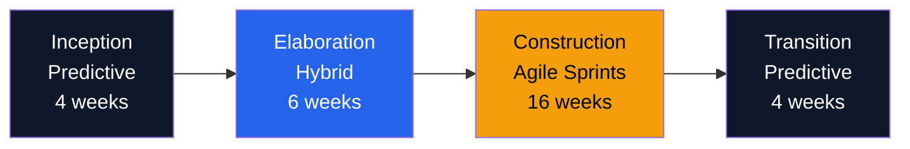

# Hybrid Methodology — Acme Corp Platform Delivery

**Project**: Customer Platform v2.0
**Methodology Lead**: PMO Center of Excellence
**Date**: 2026-Q1
**Status**: {WIP}

## Lifecycle Model

## Ceremony Calendar

| Ceremony | Phase | Frequency | Duration | Participants |
|----------|-------|-----------|----------|-------------|
| Steering Review | All | Monthly | 90 min | Steering Committee |
| Sprint Planning | Construction | Bi-weekly | 2 hours | Dev Team + PO |
| Daily Standup | Construction | Daily | 15 min | Dev Team |
| Sprint Review | Construction | Bi-weekly | 1 hour | Team + Stakeholders |
| Retrospective | Construction | Bi-weekly | 1 hour | Dev Team + SM |
| Stage Gate | Inception/Transition | Per phase | 2 hours | Program Board |
| Backlog Refinement | Elaboration/Construction | Weekly | 1 hour | PO + Tech Lead |

## Integration Points

| Predictive Artifact | Agile Artifact | Sync Mechanism |
|--------------------|---------------|----------------|
| Project Charter | Product Vision | Charter references vision doc |
| WBS Level 1-2 | Epic Backlog | WBS items = Epics |
| Milestone Plan | Release Plan | Milestones align to PI boundaries |
| Stage Gate Report | Sprint Review Demo | Gate includes sprint demo evidence |
| Change Request | Backlog Change | CR for budget; PO decision for scope |

## Governance Overlay

| Decision Type | Authority | Threshold |
|--------------|-----------|-----------|
| Sprint scope | Product Owner | Within sprint capacity |
| Feature priority | Product Owner + PM | Within release scope |
| Budget change | Steering Committee | > 5% variance |
| Schedule change | Program Board | > 2 week impact |
| Scope addition | Change Control Board | > 20 story points |

## Success Metrics

| Metric | Target | Measurement | Evidence |
|--------|--------|-------------|----------|
| Sprint Velocity | Stabilize by Sprint 3 | Story points/sprint | [METRIC] |
| Gate Pass Rate | > 90% first attempt | Gates passed/attempted | [METRIC] |
| Stakeholder Satisfaction | > 4.0/5.0 | Survey after each gate | [STAKEHOLDER] |
| Cycle Time | < 10 days per story | Jira analytics | [METRIC] |

*PMO-APEX v1.0 — Examples · Hybrid Methodology*
