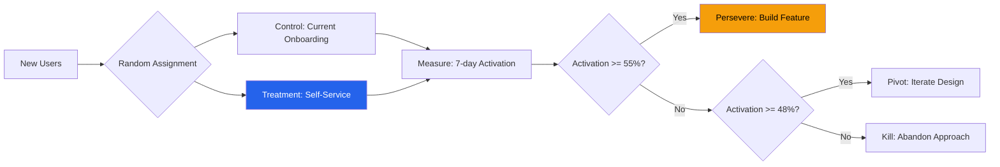

# Hypothesis-Driven Delivery — Acme Corp Mobile App

**Initiative**: Mobile Self-Service Portal
**Product Owner**: Sarah Chen
**Date**: 2026-Q1
**Status**: {WIP}

## Hypothesis Backlog

| ID | Hypothesis | Type | Priority |
|----|-----------|------|----------|
| H-01 | Self-service onboarding increases activation by 30% | Value | P1 [METRIC] |
| H-02 | Push notifications improve 7-day retention by 15% | Growth | P1 [METRIC] |
| H-03 | Biometric login reduces drop-off by 40% | Usability | P2 [INFERENCIA] |
| H-04 | Offline mode is technically feasible within 3 sprints | Feasibility | P2 [PLAN] |
| H-05 | Premium features generate 20% upsell conversion | Viability | P3 [SUPUESTO] |

## Experiment Design — H-01

**Hypothesis**: We believe that adding self-service onboarding will result in a 30% increase in user activation. We will know we succeeded when the 7-day activation rate increases from 42% to 55%.

**Experiment Type**: A/B Test
**Duration**: 3 weeks
**Sample Size**: 2,000 users (1,000 per variant, 80% power, p < 0.05)

## Experiment Schedule

| Week | Experiment | Investment | Decision Gate |
|------|-----------|------------|---------------|
| 1-3 | H-01: Self-service A/B test | 1 FTE-month | Week 4 review |
| 2-4 | H-04: Offline mode spike | 0.5 FTE-month | Week 5 review |
| 4-6 | H-02: Push notification test | 0.5 FTE-month | Week 7 review |
| 6-8 | H-03: Biometric prototype test | 0.5 FTE-month | Week 9 review |

## Decision Log

| Hypothesis | Result | Decision | Evidence |
|-----------|--------|----------|----------|
| H-01 | Pending | — | Experiment in progress [PLAN] |
| H-04 | Pending | — | Spike scheduled [SCHEDULE] |

## Portfolio Investment Summary

| Category | FTE-Months | % of Total |
|----------|-----------|------------|
| Experiments | 2.5 | 25% |
| Validated Features | 6.0 | 60% |
| Technical Foundation | 1.5 | 15% |
| **Total** | **10.0** | **100%** |

*PMO-APEX v1.0 — Examples · Hypothesis-Driven Delivery*
