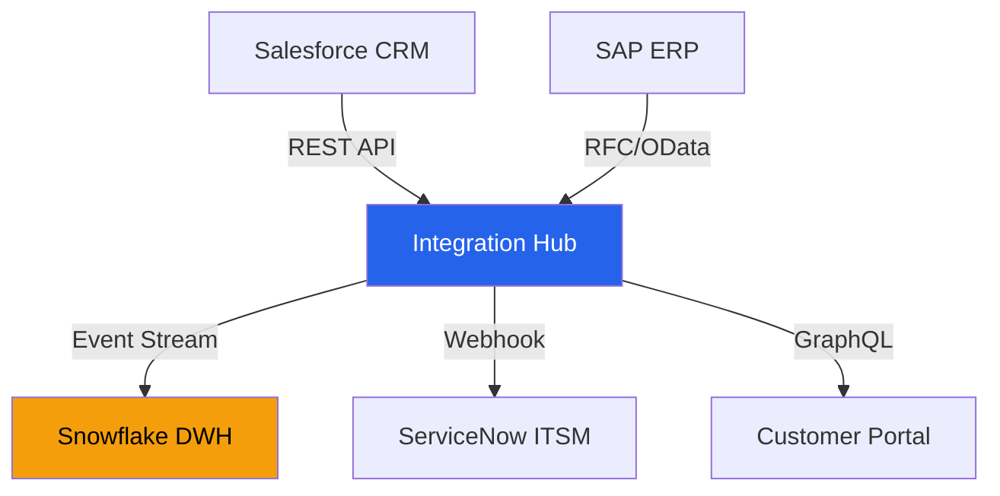

# Integration Plan — Acme Corp CRM-ERP-DWH

**Project**: Unified Customer Data Platform
**Integration Lead**: Solutions Architecture Team
**Date**: 2026-Q1
**Status**: {WIP}

## System Landscape

## Interface Catalog

| ID | Source | Target | Protocol | Frequency | Data Volume |
|----|--------|--------|----------|-----------|-------------|
| INT-01 | CRM | Hub | REST API | Real-time | 500 events/hour [METRIC] |
| INT-02 | ERP | Hub | OData | Batch (hourly) | 10K records/batch [METRIC] |
| INT-03 | Hub | DWH | Kafka Stream | Real-time | 1K events/min [METRIC] |
| INT-04 | Hub | ITSM | Webhook | Event-driven | 50 events/day [METRIC] |
| INT-05 | Hub | Portal | GraphQL | On-demand | Variable [INFERENCIA] |

## Integration Sequence

| Phase | Integration | Duration | Dependencies | Risk |
|-------|------------|----------|-------------|------|
| 1 | INT-01: CRM → Hub | 3 sprints | Hub infrastructure ready | Medium |
| 2 | INT-02: ERP → Hub | 4 sprints | Phase 1 complete | High |
| 3 | INT-03: Hub → DWH | 2 sprints | Phase 1 data flowing | Low |
| 4 | INT-04: Hub → ITSM | 1 sprint | Phase 1 complete | Low |
| 5 | INT-05: Hub → Portal | 2 sprints | Phase 2 complete | Medium |

## Data Quality Gates

| Gate | Rule | Threshold | Action on Fail |
|------|------|-----------|----------------|
| Completeness | Required fields populated | > 99% | Queue for remediation [METRIC] |
| Format | Date/number format validation | 100% | Reject record [METRIC] |
| Referential | FK references exist | > 99.5% | Log and alert [METRIC] |
| Freshness | Data age < threshold | < 1 hour for real-time | Alert integration ops [METRIC] |

## Rollback Procedures

| Integration | Rollback Trigger | Procedure | RTO |
|------------|------------------|-----------|-----|
| INT-01 | > 5% error rate | Disable CRM webhook, replay from queue | 15 min |
| INT-02 | Batch failure | Revert to last successful batch | 1 hour |
| INT-03 | Stream lag > 30 min | Switch to batch mode | 30 min |

## Effort Estimate

| Activity | FTE-Months | Evidence |
|----------|-----------|----------|
| Integration Design | 2 | [PLAN] |
| Development | 6 | [PLAN] |
| Testing | 3 | [PLAN] |
| Deployment & Stabilization | 1 | [SCHEDULE] |
| **Total** | **12** | |

*PMO-APEX v1.0 — Examples · Integration Plan*
