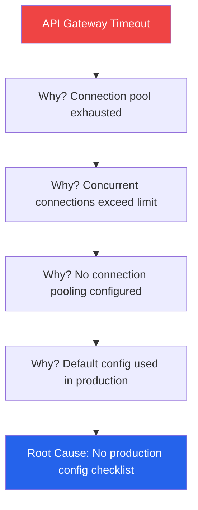

# Issue Register — Acme Corp Platform Project

**Project**: Customer Platform v2.0
**PM**: Alex Rivera
**Date**: 2026-Q1
**Status**: {WIP}

## Active Issues

| ID | Title | Category | Priority | Owner | Status | Age |
|----|-------|----------|----------|-------|--------|-----|
| ISS-001 | API gateway timeout under load | Technical | Critical | Tech Lead | In Progress | 5 days [METRIC] |
| ISS-002 | Vendor API documentation incomplete | External | High | PM | Escalated | 12 days [METRIC] |
| ISS-003 | QA environment unavailable 40% of time | Resource | High | DevOps | In Progress | 8 days [METRIC] |
| ISS-004 | Stakeholder availability for UAT | Stakeholder | Medium | PM | Open | 3 days [METRIC] |
| ISS-005 | Scope ambiguity in payment module | Scope | Medium | PO | Open | 2 days [METRIC] |

## Root Cause Analysis — ISS-001

**Containment**: Increase connection pool to 200 (immediate) [PLAN]
**Resolution**: Implement production readiness checklist [PLAN]
**Prevention**: Add connection pool monitoring alert [METRIC]

## Issue Trends

| Week | New | Resolved | Open Total | Critical |
|------|-----|----------|-----------|----------|
| W1 | 3 | 1 | 4 | 0 [METRIC] |
| W2 | 4 | 2 | 6 | 1 [METRIC] |
| W3 | 2 | 3 | 5 | 1 [METRIC] |
| W4 (current) | 1 | 1 | 5 | 1 [METRIC] |

## Escalation Status

| Issue | Escalated To | Date | Response | SLA Met |
|-------|-------------|------|----------|---------|
| ISS-001 | Program Board | 2026-01-15 | Additional DevOps allocated | Yes [METRIC] |
| ISS-002 | Vendor Account Manager | 2026-01-10 | Docs promised by EOW | No — overdue [METRIC] |

## Pattern Analysis

| Pattern | Frequency | Root Cause | Systemic Fix |
|---------|-----------|-----------|--------------|
| Environment issues | 3 in 4 weeks | Shared infrastructure | Dedicated project env [PLAN] |
| Vendor responsiveness | 2 in 4 weeks | No SLA in contract | Amend vendor agreement [STAKEHOLDER] |

*PMO-APEX v1.0 — Examples · Issue Management*
