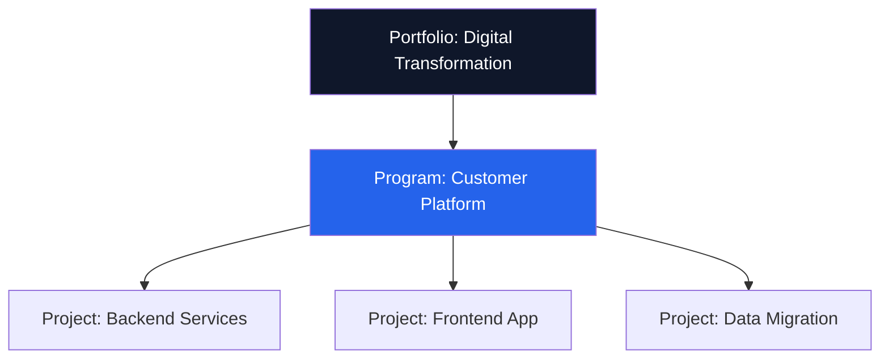

# Jira Configuration — Acme Corp Hybrid Project

**Project**: Customer Platform v2.0
**Methodology**: Hybrid (Scrum + Stage Gates)
**Date**: 2026-Q1
**Status**: {WIP}

## Project Structure

## Issue Type Scheme

| Issue Type | Level | Fields Required | Workflow |
|-----------|-------|----------------|---------|
| Initiative | Portfolio | Business value, strategic theme | Portfolio Workflow |
| Epic | Program | Acceptance criteria, target release | Epic Workflow |
| Story | Team | Story points, sprint, component | Sprint Workflow |
| Task | Team | Estimate, assignee | Sprint Workflow |
| Bug | Team | Severity, steps to reproduce | Bug Workflow |
| Risk | Project | Probability, impact, response | RAID Workflow |

## Workflow Design

**Sprint Workflow**: Backlog → Ready for Sprint → In Progress → In Review → Testing → Done

**Gate Workflow**: Draft → Submitted → Under Review → Approved / Rejected

| Transition | Condition | Validator |
|-----------|-----------|-----------|
| → In Progress | Assigned + estimated | Story points > 0 |
| → In Review | All sub-tasks complete | Sub-task check |
| → Testing | Code review approved | Linked PR merged |
| → Done | Test cases passed | DoD checklist |

## Board Configuration

| Board | Type | WIP Limits | Swimlanes |
|-------|------|-----------|-----------|
| Backend Sprint Board | Scrum | 5 per column | By assignee |
| Frontend Sprint Board | Scrum | 4 per column | By component |
| Migration Kanban | Kanban | 3/3/2/3 | By priority |

## Automation Rules

| # | Trigger | Action | Purpose |
|---|---------|--------|---------|
| 1 | Story → Done | Update Epic % complete | Progress tracking [METRIC] |
| 2 | Bug created (Severity: Critical) | Notify PM + Tech Lead | Rapid response [PLAN] |
| 3 | Issue idle > 3 days | Add comment + flag | Bottleneck detection [METRIC] |
| 4 | Sprint started | Warn unestimated stories | Sprint quality [PLAN] |
| 5 | All stories in Epic → Done | Transition Epic to Done | Cascade completion [METRIC] |

## Dashboard Gadgets

| Gadget | Filter | Audience |
|--------|--------|----------|
| Sprint Burndown | Current sprint | Team |
| Velocity Chart | Last 6 sprints | PM/SM |
| Open Issues by Priority | Project = ACME | Stakeholders |
| Gate Status | Type = Gate | Steering Committee |
| Cumulative Flow | Board columns, 30 days | Process improvement |

*PMO-APEX v1.0 — Examples · Jira Configuration*
