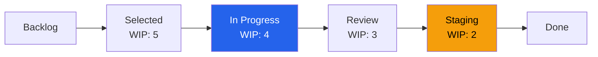

# Kanban System Design — Acme Corp DevOps Team

**Team**: Platform DevOps (8 members)
**Date**: 2026-Q1
**Status**: {WIP}

## Board Layout

## WIP Limits Rationale

| Column | WIP Limit | Rationale |
|--------|-----------|-----------|
| Selected | 5 | Buffer for ready work; ~1 week supply [PLAN] |
| In Progress | 4 | Little's Law: 4 WIP / 2 throughput = 2 day cycle [METRIC] |
| Review | 3 | Prevent review bottleneck; 24h SLE [PLAN] |
| Staging | 2 | Deployment coordination constraint [PLAN] |
| **Total System WIP** | **14** | |

## Classes of Service

| Class | Policy | SLE | WIP Allocation |
|-------|--------|-----|----------------|
| Expedite (P1 incident) | Immediate pull, swarm | 4 hours | Max 1 [METRIC] |
| Fixed Date (compliance) | Prioritize by deadline | Per commitment | 20% capacity [PLAN] |
| Standard (features/ops) | FIFO within priority | 85th pctl: 5 days | 60% capacity [METRIC] |
| Improvement (tech debt) | Friday allocation | Best effort | 20% capacity [PLAN] |

## Pull Policies

| Transition | Policy | Validation |
|-----------|--------|------------|
| Backlog → Selected | Replenishment meeting (weekly) | Acceptance criteria defined |
| Selected → In Progress | Team member pulls when capacity | WIP limit respected |
| In Progress → Review | Developer completes + PR created | All tests pass |
| Review → Staging | Reviewer approves | Code review checklist done |
| Staging → Done | Deployed + smoke tests pass | Monitoring confirms health |

## Cadence Calendar

| Day | Cadence | Duration | Focus |
|-----|---------|----------|-------|
| Mon-Fri | Daily Standup | 15 min | Flow focus, blockers |
| Monday | Replenishment | 30 min | Select new work |
| Thursday | Delivery Review | 30 min | Metrics review |
| Monthly | Service Delivery Review | 60 min | Trend analysis |
| Quarterly | Strategy Review | 90 min | Alignment check |

## Initial Metrics Dashboard

| Metric | Current Baseline | 30-Day Target | Evidence |
|--------|-----------------|---------------|----------|
| Avg Cycle Time | 7.2 days | < 5 days | [METRIC] |
| Throughput | 8 items/week | > 10 items/week | [METRIC] |
| WIP Compliance | N/A (new) | > 90% | [PLAN] |
| Flow Efficiency | 15% | > 20% | [METRIC] |

*PMO-APEX v1.0 — Examples · Kanban System*
