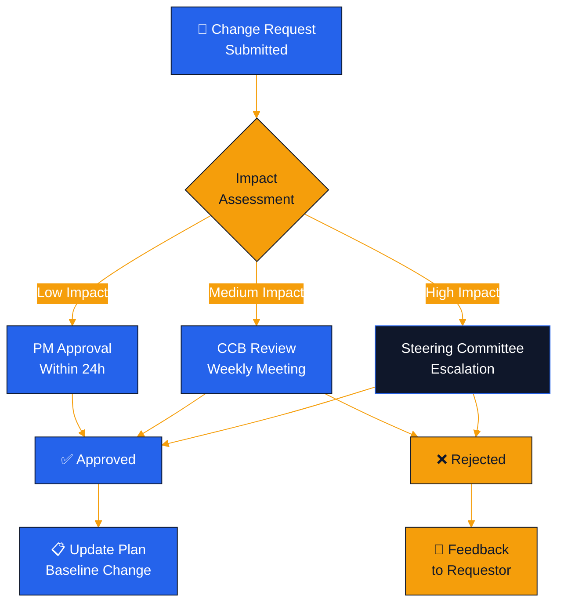

# Diagramas de Proyecto — Acme Corp ERP Modernization

> **Proyecto**: Acme Corp ERP | **Fecha**: 2026-03-17 | **Estado**: {WIP}

---

## Diagrama 1: Gantt del Cronograma

```mermaid
gantt
    title Acme Corp ERP Modernization
    dateFormat YYYY-MM-DD
    axisFormat %b %Y

    section Fase 1 - Discovery
    Stakeholder interviews    :a1, 2026-04-01, 15d
    AS-IS analysis            :a2, after a1, 20d
    Requirements              :a3, after a2, 15d
    Milestone: Discovery Gate :milestone, m1, after a3, 0d

    section Fase 2 - Design
    Solution architecture     :b1, after m1, 20d
    Data migration design     :b2, after m1, 25d
    Integration design        :b3, after b1, 15d
    Milestone: Design Gate    :milestone, m2, after b3, 0d

    section Fase 3 - Build
    Core modules              :c1, after m2, 40d
    Data migration            :c2, after m2, 35d
    Integration development   :c3, after c1, 20d
    Milestone: Build Gate     :milestone, m3, after c3, 0d

    section Fase 4 - Test & Deploy
    UAT                       :d1, after m3, 20d
    Go-live preparation       :d2, after d1, 10d
    Go-live                   :milestone, m4, after d2, 0d
```

## Diagrama 2: Proceso de Aprobación de Cambios



---

## Tabla Alternativa: Cronograma

| Fase | Actividad | Inicio | Duración | Dependencia |
|------|-----------|--------|:---:|---|
| Discovery | Stakeholder interviews | 2026-04-01 | 15d | - [SCHEDULE] |
| Discovery | AS-IS analysis | 2026-04-16 | 20d | Interviews [SCHEDULE] |
| Design | Solution architecture | 2026-05-21 | 20d | Discovery Gate [SCHEDULE] |
| Build | Core modules | 2026-07-10 | 40d | Design Gate [SCHEDULE] |
| Test | UAT | 2026-09-18 | 20d | Build Gate [SCHEDULE] |

---

*PMO-APEX v1.0 — Sample Output: Mermaid Diagramming*
*Sofka, your technology partner.*
