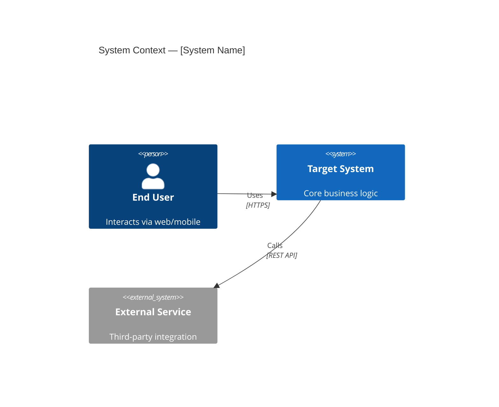
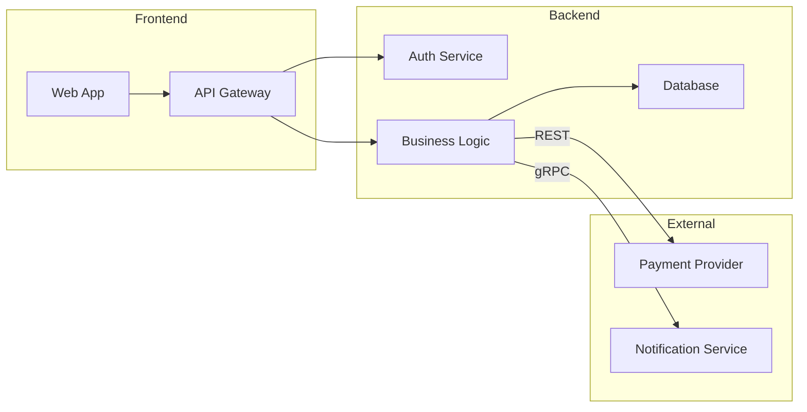
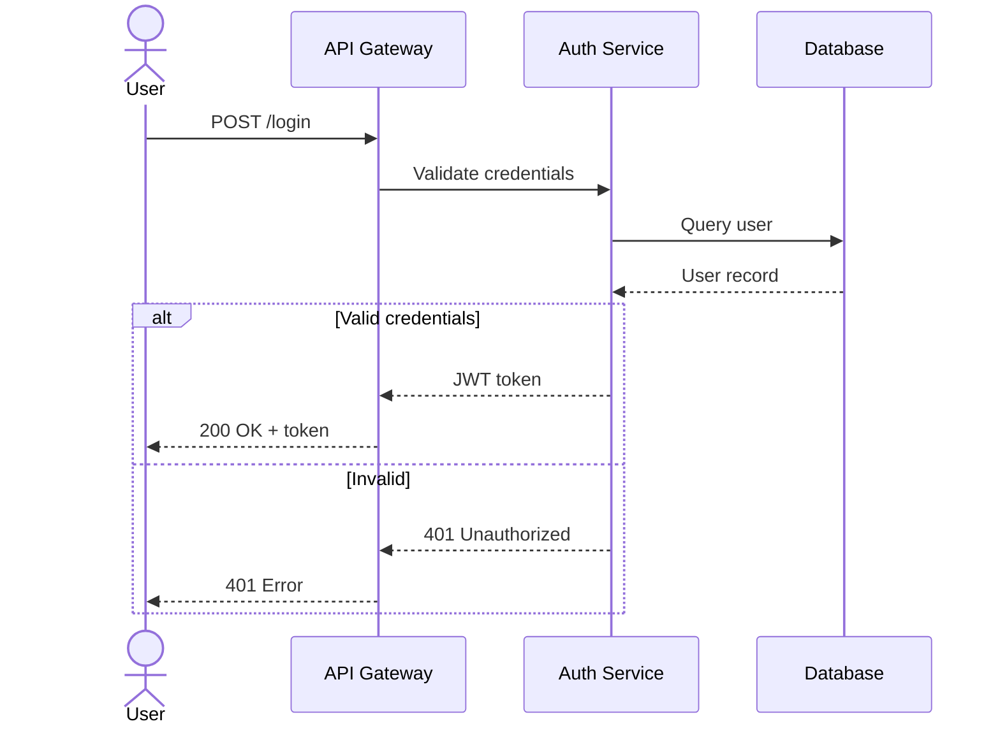
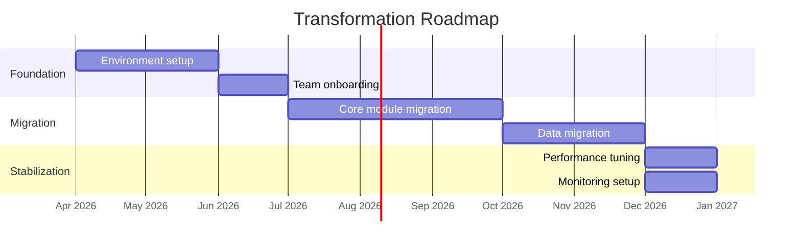
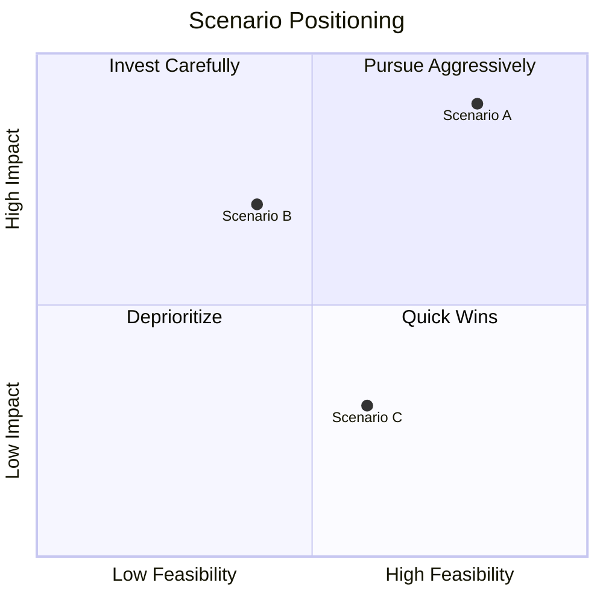
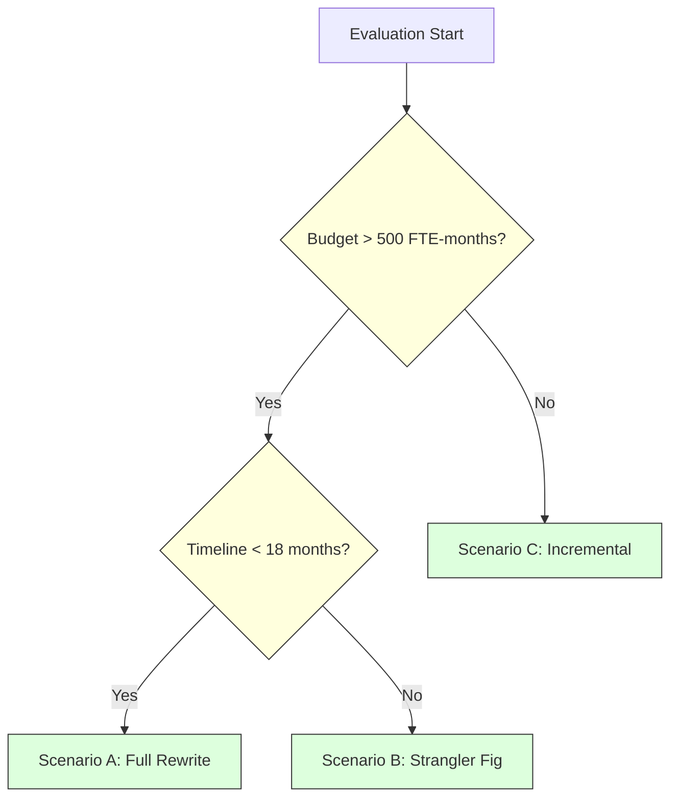
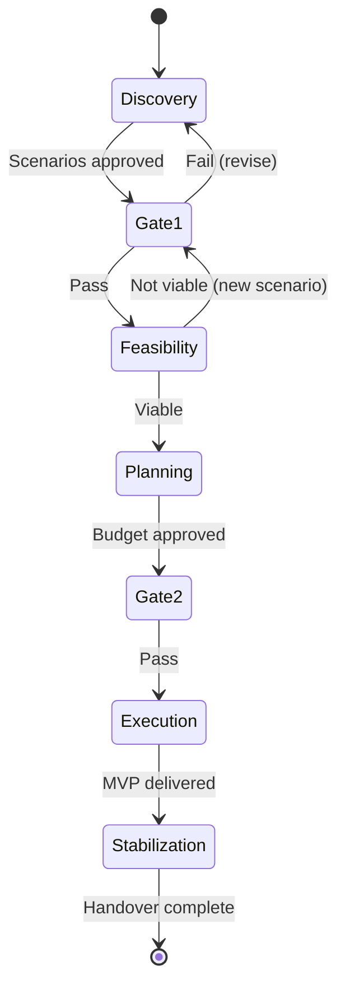
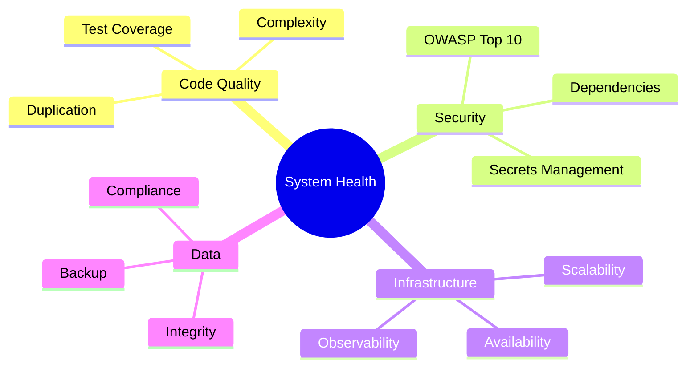

# Mermaid Pattern Library

## C4 Context Diagram

## Flowchart with Subgraphs (Integration Map)

## Sequence Diagram (E2E Flow)

## Gantt Chart (Roadmap)

## Quadrant Chart (Scoring)

## Decision Tree (Flowchart variant)

## State Diagram (Lifecycle)

## Mindmap (Decomposition)

