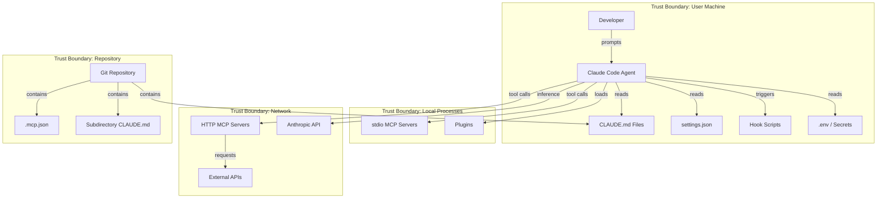

# Claude Code Threat Model

Systematic STRIDE analysis of Claude Code's 7 extension points. Each extension point represents a trust boundary where security controls must be applied. [EXPLICIT]

---

## 1. System Context Diagram



**Trust boundaries cross at**: repository files (untrusted contributors), MCP transport (local vs remote), hook execution (shell context), and plugin loading (third-party code). [EXPLICIT]

---

## 2. Data Flow Diagrams

### DFD-1: Prompt Processing Flow

```
User Prompt
  → [TB1: Chat Interface]
  → CLAUDE.md Loading (root → subdirectories, scope precedence)
  → [TB2: Instruction Merge]
  → Context Assembly (system prompt + project instructions + conversation)
  → [TB3: Inference API]
  → Anthropic API
  → Tool Decision
  → [TB4: Tool Execution]
  → Tool Result
  → [TB5: Result Injection Point]
  → Response Assembly
  → User Output
```

**Critical injection points**: TB2 (CLAUDE.md can inject instructions), TB5 (tool results can contain instruction-like content). [EXPLICIT]

### DFD-2: MCP Server Communication

```
Agent Tool Call
  → [TB6: MCP Dispatch]
  → Transport Layer (stdio pipe OR HTTP/TLS)
  → [TB7: Server Process / Remote Endpoint]
  → External System (database, API, file system)
  → Response
  → [TB8: Response Deserialization]
  → Tool Result (returned to agent context)
```

**Critical points**: TB7 (server has access to external systems), TB8 (response content enters agent context as data that could be interpreted as instructions). [EXPLICIT]

### DFD-3: Hook Execution Flow

```
Event Trigger (PreToolUse, PostToolUse, Notification, etc.)
  → [TB9: Hook Dispatch]
  → Shell Command Execution
  → [TB10: Shell Context] (env vars, file system access, network)
  → stdin: JSON payload (tool_input or tool_output)
  → Process Execution
  → stdout/stderr capture
  → Exit Code Evaluation (0=allow, 1=error, 2=block)
  → [TB11: Agent Decision Point]
```

**Critical points**: TB10 (shell has full env var access), TB11 (exit code 2 blocks tool execution — powerful security gate but also denial-of-service vector). [EXPLICIT]

---

## 3. STRIDE Per Extension Point

### 3.1 CLAUDE.md Files

| STRIDE | Threat | L | I | Risk | Mitigation |
|--------|--------|---|---|------|------------|
| **S**poofing | Fake system instructions claiming admin authority | 4 | 5 | 20 | Content review gate on CLAUDE.md changes [EXPLICIT] |
| **T**ampering | Inject malicious rules via PR or direct edit | 4 | 5 | 20 | Pre-commit validation hook [EXPLICIT] |
| **R**epudiation | No audit trail of who changed instructions | 3 | 3 | 9 | Git blame + PR review requirement [EXPLICIT] |
| **I**nfo Disclosure | CLAUDE.md leaks project secrets or internal URLs | 3 | 4 | 12 | Secrets scanning on CLAUDE.md content [EXPLICIT] |
| **D**oS | Oversize CLAUDE.md exhausts context window | 2 | 3 | 6 | Size limit enforcement [INFERRED] |
| **E**levation | Instructions escalate agent permissions beyond intended scope | 4 | 5 | 20 | Scope hierarchy enforcement, settings.json as authority [EXPLICIT] |

### 3.2 MCP Servers

| STRIDE | Threat | L | I | Risk | Mitigation |
|--------|--------|---|---|------|------------|
| **S** | Rogue MCP impersonates trusted server | 2 | 5 | 10 | Server identity verification, pinned URLs [INFERRED] |
| **T** | MCP modifies tool results to inject instructions | 3 | 5 | 15 | Response content isolation, user verification for actions [EXPLICIT] |
| **R** | No logging of MCP request/response pairs | 4 | 3 | 12 | MCP transport logging [EXPLICIT] |
| **I** | Data exfiltration through remote MCP endpoints | 3 | 5 | 15 | Data classification, egress controls [EXPLICIT] |
| **D** | Slow/hung MCP server blocks agent execution | 3 | 3 | 9 | Timeout configuration [EXPLICIT] |
| **E** | MCP grants unscoped tool access beyond intended surface | 3 | 4 | 12 | Minimal tool surface per server, tool enumeration review [EXPLICIT] |

### 3.3 Hooks

| STRIDE | Threat | L | I | Risk | Mitigation |
|--------|--------|---|---|------|------------|
| **S** | Spoofed hook event triggers unauthorized action | 2 | 4 | 8 | Event source validation [INFERRED] |
| **T** | Hook script modified to inject malicious commands | 3 | 5 | 15 | File integrity monitoring, script review [EXPLICIT] |
| **R** | No log of hook executions and outcomes | 4 | 3 | 12 | Hook execution logging [EXPLICIT] |
| **I** | Environment variables leaked through hook stdin/stdout | 3 | 4 | 12 | Env var sanitization, minimal stdin payload [EXPLICIT] |
| **D** | Hook exceeds timeout, blocking all tool execution | 3 | 4 | 12 | Strict timeout enforcement (10s max) [EXPLICIT] |
| **E** | Shell injection in hook command string → system access | 3 | 5 | 15 | Input validation, no string interpolation in commands [EXPLICIT] |

### 3.4 settings.json

| STRIDE | Threat | L | I | Risk | Mitigation |
|--------|--------|---|---|------|------------|
| **S** | Project settings override user security preferences | 3 | 4 | 12 | Scope precedence documentation, immutable user policies [EXPLICIT] |
| **T** | Modify allowed-tools to grant excessive permissions | 3 | 5 | 15 | Settings change review, PR-level visibility [EXPLICIT] |
| **R** | No change tracking for settings modifications | 3 | 3 | 9 | Git tracking for project scope, manual audit for user scope [EXPLICIT] |
| **I** | Settings expose API keys or internal configuration | 3 | 4 | 12 | Secrets in env vars not settings, .gitignore for local settings [EXPLICIT] |
| **D** | Conflicting settings across scopes cause unpredictable behavior | 2 | 3 | 6 | Scope resolution documentation [EXPLICIT] |
| **E** | dangerouslySkipPermissions removes all safety gates | 2 | 5 | 10 | Scanning for this flag, CI/CD enforcement [EXPLICIT] |

### 3.5 Plugins

| STRIDE | Threat | L | I | Risk | Mitigation |
|--------|--------|---|---|------|------------|
| **S** | Fake plugin identity impersonating trusted publisher | 2 | 5 | 10 | Publisher verification, signed plugins [INFERRED] |
| **T** | Supply chain compromise of plugin code | 2 | 5 | 10 | Version pinning, SBOM, audit before install [EXPLICIT] |
| **R** | No plugin execution audit trail | 3 | 3 | 9 | Plugin action logging [INFERRED] |
| **I** | Plugin intercepts agent context including sensitive data | 3 | 5 | 15 | Minimal plugin permissions, context isolation [INFERRED] |
| **D** | Resource exhaustion from plugin code execution | 2 | 3 | 6 | Resource limits, timeout enforcement [INFERRED] |
| **E** | Plugin code executes with agent-level permissions | 3 | 5 | 15 | Sandboxed execution, principle of least privilege [INFERRED] |

### 3.6 Agent SDK / Multi-Agent

| STRIDE | Threat | L | I | Risk | Mitigation |
|--------|--------|---|---|------|------------|
| **S** | Sub-agent impersonates parent agent identity | 2 | 4 | 8 | Agent identity isolation per fork [INFERRED] |
| **T** | Fork context manipulation to alter sub-agent behavior | 3 | 4 | 12 | Context fork sanitization [INFERRED] |
| **R** | No cross-agent execution logging | 3 | 3 | 9 | Per-agent action logging [EXPLICIT] |
| **I** | Sensitive data leaks from parent to forked agent context | 4 | 4 | 16 | Context inheritance review, minimal context forwarding [EXPLICIT] |
| **D** | Recursive agent spawning exhausts resources | 2 | 4 | 8 | Depth limits, resource budgets [EXPLICIT] |
| **E** | Sub-agent inherits parent permissions without restriction | 3 | 4 | 12 | Per-agent allowed-tools override [EXPLICIT] |

### 3.7 .env / Secrets

| STRIDE | Threat | L | I | Risk | Mitigation |
|--------|--------|---|---|------|------------|
| **S** | Environment variable override via malicious .env file | 3 | 5 | 15 | .env loading order documentation, trusted sources only [EXPLICIT] |
| **T** | Token replacement or modification in transit | 2 | 5 | 10 | Encrypted storage, immutable env injection [INFERRED] |
| **R** | No rotation tracking for API keys and tokens | 4 | 3 | 12 | Rotation policy, expiry monitoring [EXPLICIT] |
| **I** | Plaintext secrets in .env, .mcp.json, or settings.json | 4 | 5 | 20 | Secrets scanning, env var references only [EXPLICIT] |
| **D** | Missing env vars cause runtime crashes | 3 | 3 | 9 | Fail-fast validation at session start [EXPLICIT] |
| **E** | Stolen token grants full API/service access | 3 | 5 | 15 | Least-privilege tokens, scope-limited API keys [EXPLICIT] |

---

## 4. Attack Trees

### AT-1: Compromise Agent Behavior

```
ROOT: Alter agent actions without user consent
├── 1. CLAUDE.md Injection
│   ├── 1.1 Direct edit (requires repo write access)
│   ├── 1.2 PR with hidden changes (Unicode, markdown comments)
│   └── 1.3 Subdirectory CLAUDE.md override
├── 2. Prompt Injection via Tool Results
│   ├── 2.1 MCP response contains instruction-like content
│   ├── 2.2 File content with embedded instructions
│   └── 2.3 Web page content with injection payloads
├── 3. Hook Manipulation
│   ├── 3.1 Modified hook script alters agent decisions
│   └── 3.2 Hook exit code forces tool blocking/allowing
└── 4. Plugin Code Injection
    ├── 4.1 Compromised plugin alters agent context
    └── 4.2 Plugin intercepts and modifies tool calls
```

### AT-2: Exfiltrate Sensitive Data

```
ROOT: Extract confidential data from the environment
├── 1. Via MCP Servers
│   ├── 1.1 Agent reads sensitive file → sends content to remote MCP
│   ├── 1.2 MCP server logs include sensitive data from tool calls
│   └── 1.3 Remote MCP endpoint forwards data to third party
├── 2. Via Hooks
│   ├── 2.1 Hook stdin contains sensitive tool_input data
│   ├── 2.2 Hook script sends data to external endpoint
│   └── 2.3 Hook captures env vars with secrets
├── 3. Via Context Inheritance
│   ├── 3.1 Forked agent inherits parent conversation with secrets
│   └── 3.2 Sub-agent MCP access exposes parent data
└── 4. Via Configuration Exposure
    ├── 4.1 .mcp.json with hardcoded tokens committed to git
    ├── 4.2 settings.json with API keys in project scope
    └── 4.3 .env file committed to repository
```

### AT-3: Escalate Permissions

```
ROOT: Gain capabilities beyond intended agent scope
├── 1. Settings Override
│   ├── 1.1 Project settings.json overrides user restrictions
│   ├── 1.2 dangerouslySkipPermissions set in any scope
│   └── 1.3 allowed-tools expanded via nested config
├── 2. Hook Exploitation
│   ├── 2.1 Shell injection through hook command → system access
│   ├── 2.2 Hook exit code manipulation to bypass security gates
│   └── 2.3 Hook runs with user shell privileges (not sandboxed)
├── 3. MCP Server Escalation
│   ├── 3.1 MCP server provides tools beyond documented scope
│   ├── 3.2 MCP tool description misleads agent into unsafe actions
│   └── 3.3 Unvetted MCP grants access to sensitive systems
└── 4. Agent Inheritance
    ├── 4.1 Sub-agent inherits parent allowed-tools without restriction
    └── 4.2 Agent spawns additional agents beyond depth limit
```

---

## 5. Risk Priority Matrix

Score = Likelihood (1-5) x Impact (1-5). Top risks from all extension points:

| Rank | Risk | Score | Extension Point | Category |
|------|------|-------|-----------------|----------|
| 1 | CLAUDE.md instruction injection via PR | 20 | CLAUDE.md | Tampering |
| 2 | CLAUDE.md spoofing admin authority | 20 | CLAUDE.md | Spoofing |
| 3 | Permission escalation via CLAUDE.md instructions | 20 | CLAUDE.md | Elevation |
| 4 | Plaintext secrets in configuration files | 20 | .env/Secrets | Info Disclosure |
| 5 | Context inheritance leaks sensitive data to sub-agents | 16 | Agent SDK | Info Disclosure |
| 6 | MCP response injection alters agent behavior | 15 | MCP Servers | Tampering |
| 7 | Data exfiltration through remote MCP endpoints | 15 | MCP Servers | Info Disclosure |
| 8 | Shell injection via hook commands | 15 | Hooks | Elevation |
| 9 | Hook script tampering for malicious execution | 15 | Hooks | Tampering |
| 10 | Settings.json allowed-tools expansion | 15 | settings.json | Tampering |

**Interpretation**: CLAUDE.md is the highest-risk extension point because it directly controls agent behavior and is modifiable by anyone with repository write access. Secrets exposure is the second critical area. [INFERRED]

---

## 6. Risk Register Template

Use this template for project-specific risk tracking:

| Risk ID | Description | Extension Point | STRIDE | L (1-5) | I (1-5) | Score | Owner | Mitigation | Status | Review Date |
|---------|-------------|-----------------|--------|---------|---------|-------|-------|------------|--------|-------------|
| R-001 | | | | | | | | | Open | |
| R-002 | | | | | | | | | Open | |
| R-003 | | | | | | | | | Open | |

**Status values**: Open, In Progress, Mitigated, Accepted, Transferred, Closed. [EXPLICIT]

**Review cadence**: Monthly for scores >=15, quarterly for scores 8-14, annually for scores <8. [INFERRED]
