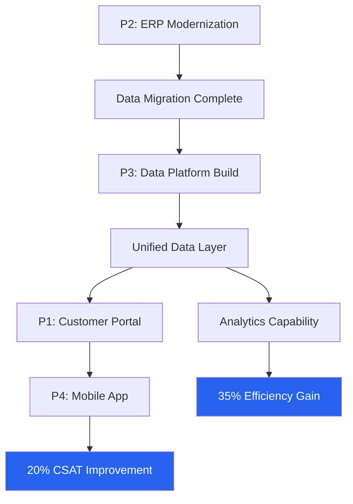

# Program Charter — Acme Corp Digital Transformation Program

## TL;DR
Multi-project program to modernize Acme Corp's customer-facing platforms, internal operations, and data infrastructure over 18 months. Expected benefit: 35% operational efficiency gain and 20% customer satisfaction improvement. [PLAN]

## 1. Program Vision
Transform Acme Corp from legacy-dependent operations to a digitally-enabled enterprise, delivering integrated customer experiences and data-driven decision-making. [STAKEHOLDER]

## 2. Component Projects

| Project | Duration | Dependencies | Status |
|---------|----------|-------------|--------|
| P1: Customer Portal Redesign | 6 months | P3 (data layer) | Planned |
| P2: ERP Modernization | 12 months | None | In Progress |
| P3: Data Platform Build | 9 months | P2 (data migration) | Planned |
| P4: Mobile App Launch | 4 months | P1 (API layer) | Pending P1 |
| P5: Change Management | 18 months | All projects | Active |

## 3. Benefits Dependency Network

## 4. Governance Structure

| Role | Person | Responsibility |
|------|--------|---------------|
| Program Sponsor | CTO | Strategic direction, funding approval |
| Program Manager | J. Rivera | Day-to-day coordination, risk management |
| Business Lead | VP Operations | Benefit ownership, change adoption |
| Technical Lead | Enterprise Architect | Architecture governance, integration |

## 5. Program-Level Risks

| Risk | Probability | Impact | Response |
|------|------------|--------|----------|
| ERP vendor delays | Medium | High | Contractual SLAs + parallel workstreams [PLAN] |
| Data migration quality | High | High | Phased migration with validation gates [METRIC] |
| Change resistance | Medium | Medium | Early engagement + training program [STAKEHOLDER] |
| Resource contention (P1/P3) | High | Medium | Resource pooling + priority matrix [PLAN] |

## 6. Program Milestones

| Milestone | Target Date | Gate |
|-----------|------------|------|
| Program Kickoff | Month 1 | G0 |
| ERP Core Go-Live | Month 8 | G1 |
| Data Platform MVP | Month 10 | G1.5 |
| Customer Portal Launch | Month 14 | G2 |
| Mobile App Release | Month 16 | G2.5 |
| Program Closure | Month 18 | G3 |

## 7. Resource Summary

| Role | FTE-months | Allocation |
|------|-----------|------------|
| Program Manager | 18 | 100% |
| Technical Architects | 36 | 2 x 100% |
| Business Analysts | 27 | 3 x 50% |
| Change Managers | 18 | 1 x 100% |
| QA Engineers | 24 | 2 x 67% |

**Total Program Investment: 123 FTE-months** [METRIC]

*PMO-APEX v1.0 — Sample Output · Program Management*
