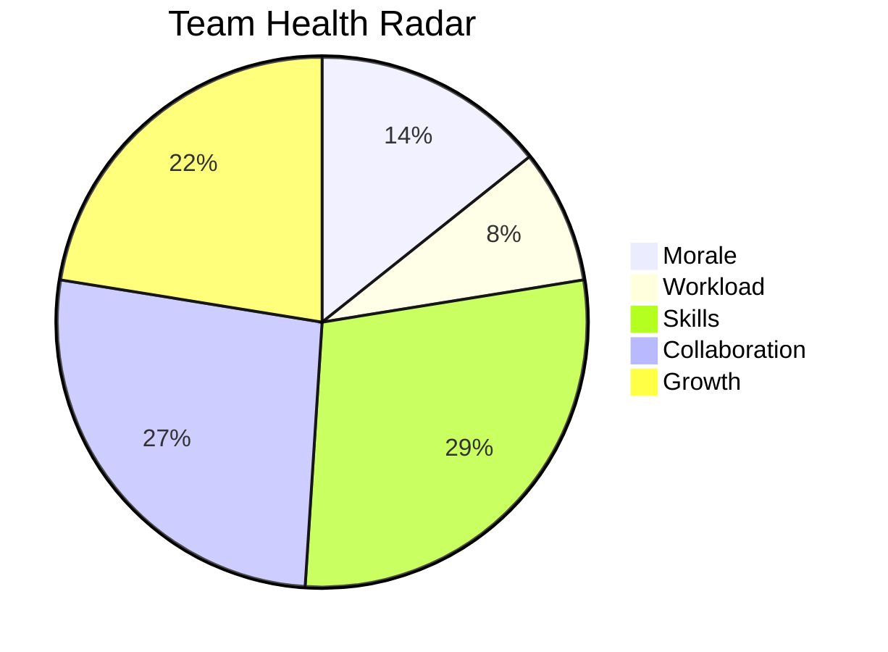

# Project Health Check — Acme Corp ERP Modernization (Q2 2026)

## Executive Dashboard

| Dimension | Status | Trend | Score |
|-----------|--------|-------|-------|
| Schedule | AMBER | Declining | 6.5/10 |
| Budget | GREEN | Stable | 8.0/10 |
| Scope | GREEN | Stable | 7.5/10 |
| Quality | AMBER | Declining | 6.0/10 |
| Team | RED | Declining | 4.5/10 |
| Stakeholder | GREEN | Improving | 7.8/10 |
| **Overall** | **AMBER** | **Mixed** | **6.7/10** |

## Schedule Health — AMBER

- SPI = 0.88 (target: ≥ 0.95) [METRIC]
- 2 of 5 Q2 milestones delivered late (average 8 days delay)
- Critical path has consumed 60% of total float in 3 sprints
- **Root cause:** Integration testing taking 40% longer than estimated [PLAN]
- **Action:** Add dedicated integration test environment, parallelize test execution

## Budget Health — GREEN

- CPI = 1.02 (within tolerance) [METRIC]
- Burn rate: 94% of planned rate
- EAC = 98.5 FTE-months vs. BAC = 100 FTE-months
- No budget escalation required

## Quality Health — AMBER

- Defect density: 3.2 per story point (target: < 2.5) [METRIC]
- Test coverage: 72% (target: 80%)
- Defect reopen rate: 18% (threshold: 15%)
- **Root cause:** Insufficient unit testing in data migration module
- **Action:** Mandate 80% coverage for all new code, defect triage daily

## Team Health — RED

- Team overtime averaging 135% for 4 consecutive sprints [METRIC]
- 1 senior developer resignation (notice period: 30 days)
- Morale survey: 3.1/5.0 (previous: 4.0/5.0) [STAKEHOLDER]
- **Root cause:** Sustained crunch from schedule pressure + insufficient onboarding of new members
- **Action:** Immediate scope negotiation to reduce sprint load by 20%, backfill within 2 weeks

## Corrective Action Plan

| Action | Owner | Deadline | Priority |
|--------|-------|----------|----------|
| Reduce sprint scope by 20% | Scrum Master | Immediately | Critical |
| Backfill senior developer | Resource Manager | 2 weeks | Critical |
| Add integration test environment | Tech Lead | Sprint 14 | High |
| Enforce 80% test coverage | QA Lead | Sprint 13 | High |
| Team wellness check-in (1:1s) | PM | This week | High |

## Recommendation to Steering Committee

The project requires **AMBER escalation** with focus on team health recovery. Without intervention, the RED team dimension will cascade into schedule and quality within 2-3 sprints. Budget health provides room for tactical resource additions. [PLAN]

*PMO-APEX v1.0 — Sample Output · Project Health Check*
