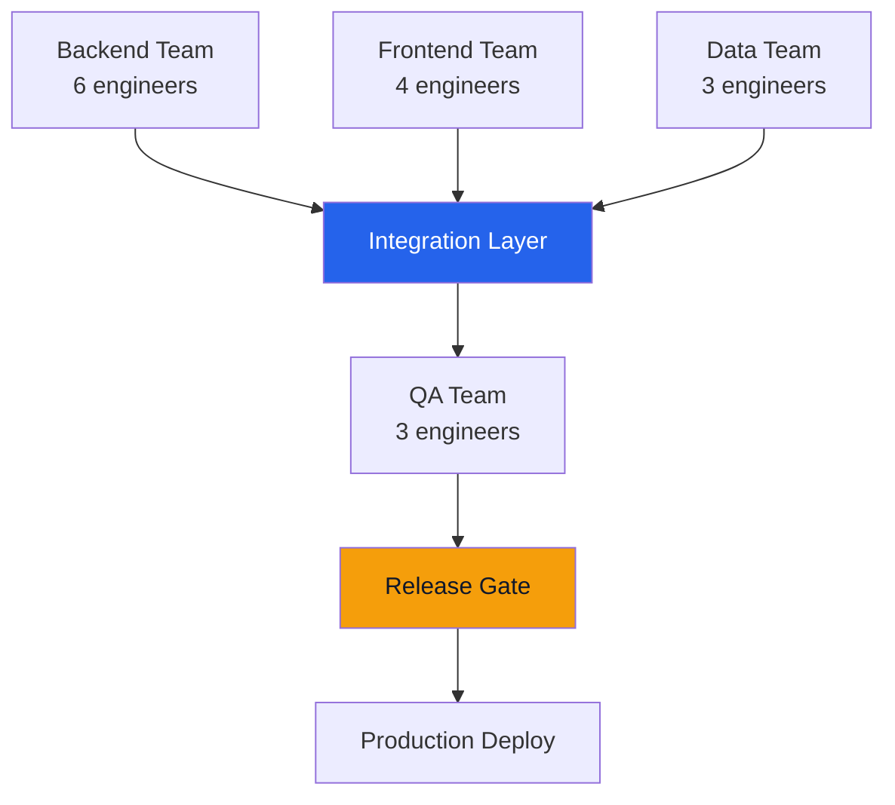

# Orchestration Framework — Acme Corp Platform Delivery

## TL;DR
Orchestration design for 4-team platform delivery (Backend, Frontend, Data, QA) with 12 cross-team dependencies, 2-week sprint cadence, and automated handoff management. [PLAN]

## 1. Team Topology

## 2. Ceremony Calendar

| Ceremony | Frequency | Duration | Participants | Purpose |
|----------|-----------|----------|-------------|---------|
| Sprint Planning | Bi-weekly (Mon) | 2 hours | All teams | Commitment + dependency sync |
| Daily Standup | Daily | 15 min | Per team | Team-level coordination |
| Scrum of Scrums | Tue/Thu | 30 min | Team leads | Cross-team blockers |
| Demo | Bi-weekly (Fri) | 1 hour | All + stakeholders | Value validation |
| Retrospective | Bi-weekly (Fri) | 1 hour | All teams | Process improvement |

## 3. Dependency Board

| Dependency | From | To | Sprint | Status |
|-----------|------|-----|--------|--------|
| API v2 endpoints | Backend | Frontend | S14 | In Progress [PLAN] |
| Data pipeline | Data | Backend | S13 | Complete [METRIC] |
| Test environment | QA | All teams | S14 | At Risk [PLAN] |
| Auth service | Backend | Frontend | S15 | Not Started |

## 4. Automation Rules

| Trigger | Automated Action | Tool |
|---------|-----------------|------|
| PR merged to main | Notify QA team, update board | GitHub Actions + Slack |
| Sprint velocity calculated | Update dashboard, flag variance > 15% | Jira + Power BI |
| Blocker created | Alert Scrum of Scrums channel | Jira webhook + Slack |
| All tests pass on staging | Trigger release candidate build | CI/CD pipeline |

## 5. Escalation Matrix

| Level | Condition | Resolver | SLA |
|-------|-----------|----------|-----|
| L1 | Within-team blocker | Scrum Master | 4 hours |
| L2 | Cross-team dependency blocked | Project Orchestrator | 24 hours |
| L3 | Resource contention | Delivery Manager | 48 hours |
| L4 | Strategic scope conflict | Steering Committee | 1 week |

**Flow Efficiency Target: 45%** | **Current: 32%** | **Improvement Plan: +13% over 3 sprints** [METRIC]

*PMO-APEX v1.0 — Sample Output · Project Orchestrator*
