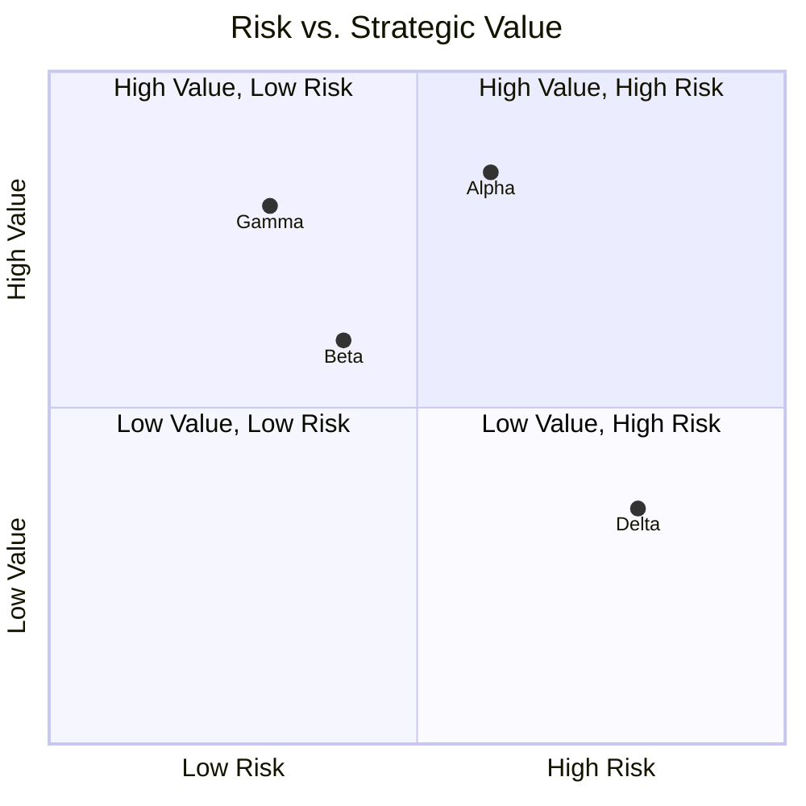

# Project Selection Report — Acme Corp Q3 2026 Portfolio Review

## TL;DR
Four proposals evaluated against 5 weighted criteria. Recommend funding Project Alpha (AI Customer Service) and Project Gamma (Data Warehouse Modernization). Defer Project Beta. Reject Project Delta. [PLAN]

## 1. Weighted Scoring Matrix

| Criterion | Weight | Alpha (AI CS) | Beta (Mobile) | Gamma (DW) | Delta (IoT) |
|-----------|--------|:---:|:---:|:---:|:---:|
| Strategic alignment | 30% | 9 | 7 | 8 | 5 |
| Financial value (NPV) | 25% | 8 | 6 | 9 | 4 |
| Risk profile (inverted) | 20% | 6 | 7 | 8 | 3 |
| Resource feasibility | 15% | 7 | 5 | 7 | 6 |
| Time to value | 10% | 8 | 8 | 5 | 4 |
| **Weighted Score** | **100%** | **7.75** | **6.55** | **7.80** | **4.45** |
| **Rank** | | **2** | **3** | **1** | **4** |

## 2. Portfolio Balance Analysis

## 3. Resource Requirements

| Project | FTE-months | Key Skills | Start | Duration |
|---------|-----------|------------|-------|----------|
| Alpha | 24 | ML engineers, UX designers | Q3 | 6 months |
| Gamma | 18 | Data engineers, DBAs | Q3 | 5 months |
| Beta (deferred) | 15 | Mobile devs, QA | Q4 | 4 months |
| **Total Selected** | **42** | | | |

Available capacity: 48 FTE-months (Q3-Q4) [METRIC]

## 4. Recommendation

| Project | Decision | Rationale |
|---------|----------|-----------|
| Gamma (DW) | **FUND** | Highest score, low risk, enables Alpha [PLAN] |
| Alpha (AI CS) | **FUND** | High strategic value, acceptable risk [PLAN] |
| Beta (Mobile) | **DEFER to Q4** | Good project, insufficient Q3 capacity [PLAN] |
| Delta (IoT) | **REJECT** | Low strategic fit, high risk, poor NPV [METRIC] |

## 5. Sensitivity Analysis

Selection is robust: ranking reversal requires >25% weight change in any single criterion. Alpha and Gamma swap positions only if financial value weight exceeds 40%. [METRIC]

*PMO-APEX v1.0 — Sample Output · Project Selection*
