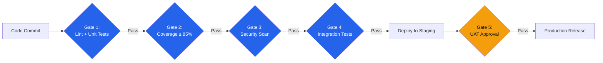

# Quality Plan — Acme Corp E-Commerce Platform

## TL;DR
Quality plan covering 5 deliverable streams with ISO 9001 alignment, automated quality gates in CI/CD, and target defect density of <2.0 per KLOC. [PLAN]

## 1. Quality Objectives

| Objective | Metric | Target | Measurement |
|-----------|--------|--------|-------------|
| Code quality | Defect density | < 2.0 per KLOC | SonarQube [METRIC] |
| Test coverage | Line coverage | ≥ 85% | Jest/JaCoCo [METRIC] |
| User acceptance | UAT pass rate | ≥ 95% first submission | Test management tool |
| Performance | Page load time | < 2 seconds (P95) | Lighthouse/k6 |
| Accessibility | WCAG compliance | Level AA | axe-core automated |

## 2. Quality Activities

| Activity | Frequency | Responsible | Deliverables Covered |
|----------|-----------|-------------|---------------------|
| Code review | Every PR | Development team | All code changes [PLAN] |
| Unit testing | Continuous (CI) | Developers | All modules |
| Integration testing | Daily build | QA team | API + DB layers |
| Performance testing | Sprint end | QA specialist | Critical paths |
| Security scan | Weekly | DevSecOps | Full application |
| UAT | Pre-release | Business analysts | User-facing features |

## 3. Quality Gates

## 4. Roles and Responsibilities

| Role | Quality Responsibility |
|------|----------------------|
| QA Lead | Quality plan ownership, audit coordination |
| Developers | Unit tests, code review participation, defect resolution |
| Scrum Master | Process quality, retro-driven improvement |
| Product Owner | Acceptance criteria definition, UAT sign-off [STAKEHOLDER] |
| DevOps Engineer | Quality gate automation, monitoring setup |

## 5. Cost of Quality Estimate

| Category | Effort (FTE-months) | % of Project |
|----------|-------------------|-------------|
| Prevention (training, tools, process) | 4 | 8% |
| Appraisal (testing, reviews, audits) | 8 | 16% |
| **Total Quality Investment** | **12** | **24%** |

Target: Internal + external failure costs < 5% of project effort [METRIC]

*PMO-APEX v1.0 — Sample Output · Quality Plan*
