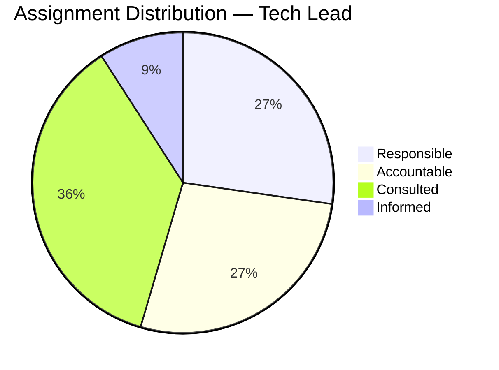

# RACI Matrix — Acme Corp Platform Migration

## TL;DR
Responsibility assignment for 8 key activities across 6 roles in the platform migration project. One overloaded role identified (Tech Lead) with rebalancing recommendation. [PLAN]

## RACI Matrix

| Activity | PM | Tech Lead | BA | QA Lead | DevOps | Sponsor |
|----------|:--:|:---------:|:--:|:-------:|:------:|:-------:|
| Requirements gathering | R | C | R | I | I | A |
| Architecture design | I | R,A | C | I | C | I |
| Sprint planning | R,A | C | R | C | I | I |
| Development execution | I | R,A | I | I | R | I |
| Test strategy | C | C | I | R,A | I | I |
| Deployment pipeline | I | C | I | C | R,A | I |
| UAT coordination | R | I | R,A | R | I | C |
| Go-live decision | R | C | C | C | C | A |

## Validation Results

| Check | Status | Notes |
|-------|--------|-------|
| One A per row | PASS | All activities have exactly one A [METRIC] |
| At least one R per row | PASS | All activities have R assignments |
| No empty columns | PASS | All roles have assignments |
| Overload check | WARNING | Tech Lead has R or A in 5/8 activities [PLAN] |

## Role Workload Analysis

## Recommendation

**Tech Lead is overloaded** with 5 R/A assignments. Recommend:
1. Delegate "Development execution" A to a Senior Developer [PLAN]
2. Reduce C assignments on Sprint Planning — downgrade to I [STAKEHOLDER]
3. Consider splitting Tech Lead into Architecture Lead and Engineering Lead for the program duration

**All other roles are within healthy assignment ranges (2-4 R/A per role).** [METRIC]

*PMO-APEX v1.0 — Sample Output · RACI Matrix*
