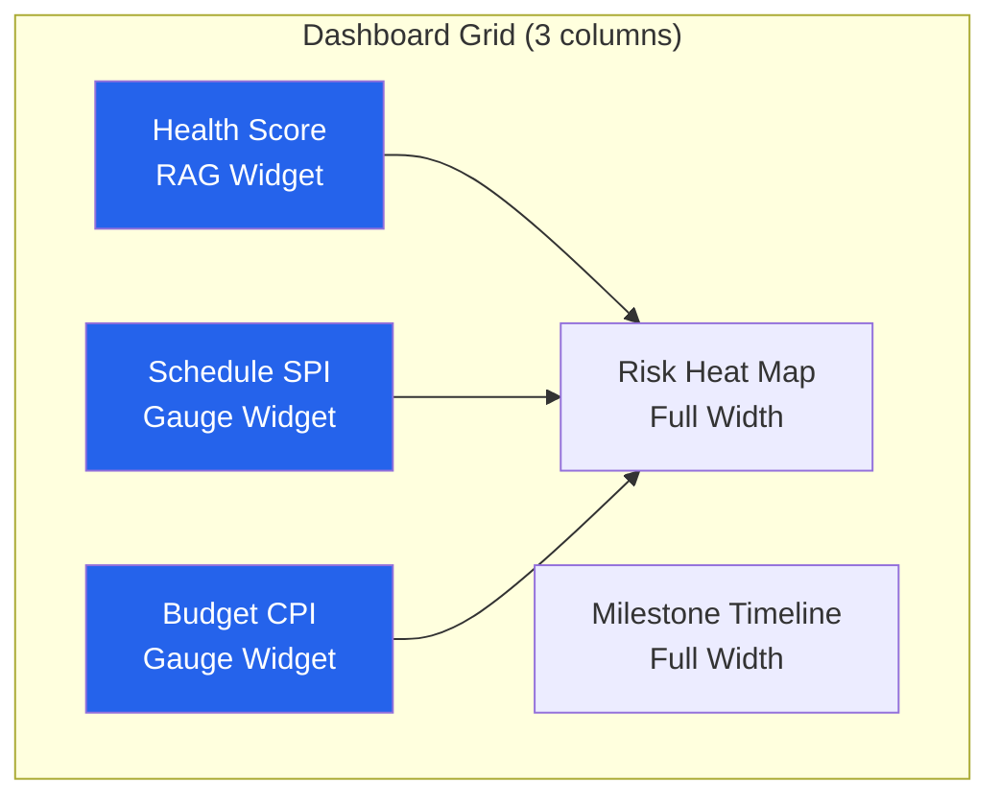

# Rendering Specification — Acme Corp Project Dashboard

## TL;DR
Rendering configuration for a multi-widget project dashboard displaying health metrics, schedule, budget, and risk data with APEX branding. [PLAN]

## 1. Design Token Application

```css
:root {
  --apex-royal: #2563EB;
  --apex-amber: #F59E0B;
  --apex-dark: #0F172A;
  --apex-bg: #F8FAFC;
  --apex-success: #2563EB;
  --apex-warning: #F59E0B;
  --apex-danger: #EF4444;
  --font-primary: 'Inter', sans-serif;
  --font-mono: 'JetBrains Mono', monospace;
  --radius-card: 12px;
  --shadow-card: 0 2px 8px rgba(0,0,0,0.08);
}
```

## 2. Dashboard Layout



## 3. Widget Specifications

| Widget | Type | Data Source | Refresh |
|--------|------|-----------|---------|
| Health Score | RAG indicator + score | project-health-check | Sprint end [METRIC] |
| Schedule SPI | Gauge chart | schedule-baseline | Weekly |
| Budget CPI | Gauge chart | budget-tracking | Weekly |
| Risk Heat Map | Matrix visualization | risk-monitoring | Sprint end |
| Milestone Timeline | Gantt-style bar | schedule-baseline | On change |

## 4. Rendering Output

| Format | Target | Optimization |
|--------|--------|-------------|
| HTML (interactive) | Browser dashboard | Responsive, 3-col → 1-col mobile |
| PDF (static) | Steering review attachment | Print-optimized, A4 landscape |
| PNG (snapshot) | Email/Slack sharing | Fixed 1200x800px |

## 5. Accessibility Compliance

| Check | Status | Evidence |
|-------|--------|----------|
| Color contrast (4.5:1) | PASS | All text meets AA ratio [METRIC] |
| Semantic structure | PASS | Proper heading hierarchy |
| Table headers | PASS | All data tables use th elements |
| Keyboard navigation | PASS | Tab order follows visual layout |

*PMO-APEX v1.0 — Sample Output · Rendering Engine*
