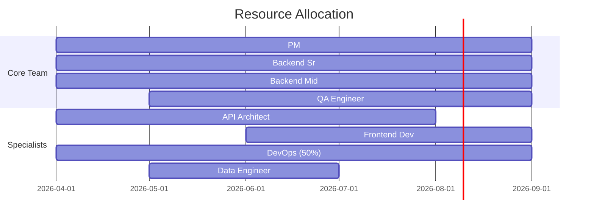

# Resource Plan — Acme Corp API Modernization

## TL;DR
6-person core team + 2 specialists for a 5-month API modernization. Total investment: 34 FTE-months. Key gap: no in-house event-driven architecture expertise — contractor recommended. [PLAN]

## 1. Resource Requirements

| Role | Skills Required | Allocation | Duration | Source |
|------|----------------|-----------|----------|--------|
| Project Manager | PM, Agile, stakeholder mgmt | 100% | 5 months | Internal [PLAN] |
| API Architect | REST, GraphQL, event-driven | 100% | 4 months | Contractor [SUPUESTO] |
| Backend Dev (Sr) | Java, Spring Boot, Kafka | 100% | 5 months | Internal |
| Backend Dev (Mid) | Java, Spring Boot | 100% | 5 months | Internal |
| Frontend Dev | React, TypeScript | 75% | 3 months | Internal |
| QA Engineer | API testing, automation | 100% | 4 months | Internal |
| DevOps Engineer | K8s, CI/CD, AWS | 50% | 5 months | Shared pool |
| Data Engineer | Migration, ETL | 100% | 2 months | Internal |

## 2. Allocation Timeline

## 3. Budget Summary

| Category | FTE-months |
|----------|-----------|
| Core team (internal) | 25 |
| Specialists (contractor) | 4 |
| Shared resources (50%) | 2.5 |
| Onboarding buffer | 0.5 |
| **Total** | **32 FTE-months** |

[METRIC] — Within 34 FTE-month budget ceiling

## 4. Key Risks

| Risk | Impact | Mitigation |
|------|--------|-----------|
| Contractor availability (API Architect) | High | Start sourcing immediately, 4-week lead time [SUPUESTO] |
| QA Engineer shared with other project | Medium | Formal allocation agreement with functional manager [STAKEHOLDER] |
| Data Engineer only available 2 months | Medium | Front-load migration work, knowledge transfer to Backend Sr [PLAN] |

*PMO-APEX v1.0 — Sample Output · Resource Plan*
