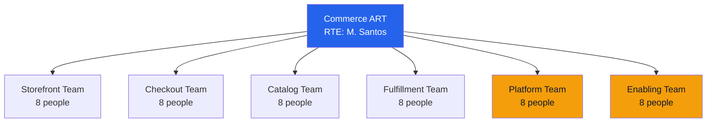

# ART Launch Plan — Acme Corp Commerce ART

## TL;DR
Commerce ART launching with 6 teams (48 people), 10-week PI cadence, aligned to "Digital Commerce" value stream. First PI Planning scheduled for Q3 2026 Week 1. [PLAN]

## 1. ART Configuration

| Element | Detail |
|---------|--------|
| ART Name | Commerce ART |
| Value Stream | Digital Commerce |
| Teams | 6 (4 stream-aligned, 1 platform, 1 enabling) |
| PI Cadence | 5 iterations x 2 weeks = 10 weeks + 1 IP iteration |
| Configuration | Essential SAFe |

## 2. Team Structure

## 3. Ceremony Calendar

| Ceremony | When | Duration | Facilitator |
|----------|------|----------|-------------|
| PI Planning | PI start (Day 1-2) | 2 days | RTE [STAKEHOLDER] |
| Sprint Planning | Sprint Day 1 | 2 hours | Scrum Masters |
| Daily Standup | Daily | 15 min | Scrum Masters |
| System Demo | Sprint end (Friday) | 1 hour | RTE |
| Scrum of Scrums | Tue/Thu | 30 min | RTE |
| Inspect & Adapt | PI end | 4 hours | RTE + Agile Coach |

## 4. Success Metrics (First 2 PIs)

| Metric | Target PI-1 | Target PI-2 |
|--------|:----------:|:----------:|
| PI Predictability | ≥ 60% | ≥ 75% [METRIC] |
| Feature Cycle Time | Establish baseline | -20% from baseline |
| Team Velocity Stability | CV < 30% | CV < 20% |
| Deployment Frequency | Bi-weekly | Weekly |
| Team Satisfaction | ≥ 3.5/5 | ≥ 4.0/5 [STAKEHOLDER] |

## 5. Launch Timeline

| Week | Activity |
|------|----------|
| W-8 | ART roles assigned, team formation begins |
| W-6 | SAFe training (2-day Leading SAFe, 2-day SAFe for Teams) |
| W-4 | Tool setup (Jira, CI/CD), program backlog initial population |
| W-2 | PI Planning dry run, management briefing prep |
| W-0 | **First PI Planning Event** [PLAN] |

*PMO-APEX v1.0 — Sample Output · SAFe Framework*
